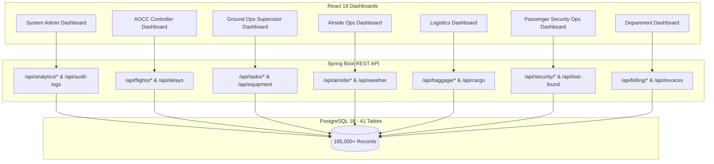
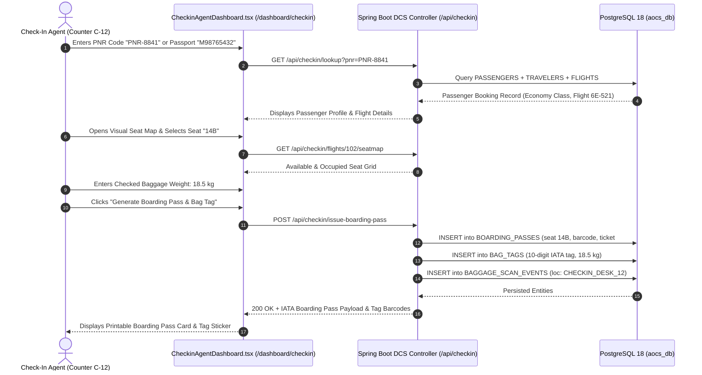
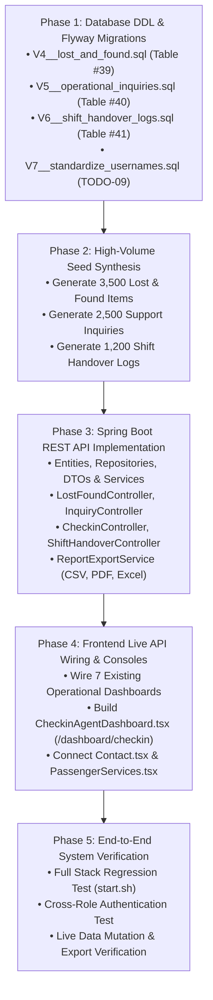

# 📘 SAPHIRE AOCS: System Requirements Specification (SRS) & Database Engineering To-Do Document

**Project**: Saphire Airport Operations & Control System (AOCS)  
**Document Type**: System Requirements Specification & Relational Schema Expansion Masterplan  
**Lead Architect & Database Lead**: Krishna Solanki  
**Baseline Database Engine**: PostgreSQL 18 (`localhost:5432/aocs_db`)  
**Backend Framework**: Spring Boot 3.x (Java 17 / Maven / Port 8080)  
**Frontend Framework**: React 18 + TypeScript + Vite + Tailwind CSS (Port 3000)  
**Current Baseline**: 38 Relational Tables | 158,660+ Live Operational Records  
**Target Architecture**: 41 Relational Tables | 185,000+ Records | 8 Dedicated Operational Consoles  

---

## 📑 TABLE OF CONTENTS
1. [Executive Summary & Architectural Baseline](#1-executive-summary--architectural-baseline)
2. [Master Implementation Roadmap & Status Registry](#2-master-implementation-roadmap--status-registry)
3. [TODO-01: Lost & Found Central Bureau Subsystem (Table #39)](#3-todo-01-lost--found-central-bureau-subsystem-table-39)
4. [TODO-02: Operational Inquiries & Passenger Support Desk (Table #40)](#4-todo-02-operational-inquiries--passenger-support-desk-table-40)
5. [TODO-03: Staff Corporate Email Support & Dual-Identifier Authentication](#5-todo-03-staff-corporate-email-support--dual-identifier-authentication)
6. [TODO-04: Full-Stack Live Database Wiring & Reactive State Synchronization](#6-todo-04-full-stack-live-database-wiring--reactive-state-synchronization)
7. [TODO-05: Enterprise Operational Reports & Multi-Format Exporters Engine](#7-todo-05-enterprise-operational-reports--multi-format-exporters-engine)
8. [TODO-06: Airfield Shift Handover & Operations Logbook (Table #41)](#8-todo-06-airfield-shift-handover--operations-logbook-table-41)
9. [TODO-07: Runway Surface Vectors & METAR Telemetry Integration](#9-todo-07-runway-surface-vectors--metar-telemetry-integration)
10. [TODO-08: Dedicated Check-In Desk & Boarding Pass Issuance Console](#10-todo-08-dedicated-check-in-desk--boarding-pass-issuance-console)
11. [TODO-09: Enterprise Username Standardization (`first.last`)](#11-todo-09-enterprise-username-standardization-firstlast)
12. [Master 41-Table Relational Schema Cross-Reference Matrix](#12-master-41-table-relational-schema-cross-reference-matrix)
13. [Engineering Execution Order & Verification Gates](#13-engineering-execution-order--verification-gates)

---

## 1. Executive Summary & Architectural Baseline

The Saphire Airport Operations and Control System (AOCS) is an enterprise-grade mission-critical airport management platform. The platform coordinates landside passenger handling, security clearance, airside aircraft turnaround, gate/stand management, baggage handling systems (BHS), runway telemetry, and airline billing.

### 1.1 Existing Relational Core (38 Tables)
The active PostgreSQL 18 instance hosts 38 relational tables structured into 6 operational domains:
1. **Security & Identity Governance (4 tables)**: `roles`, `departments`, `users`, `user_phone_numbers`
2. **Aerodrome & Airfield Infrastructure (8 tables)**: `airlines`, `airports`, `aircraft_types`, `aircraft`, `gates`, `checkin_counters`, `stands`, `runways`
3. **Flight Operations & Dispatch (5 tables)**: `weather_reports`, `gate_assignment_rules`, `flights`, `delay_codes`, `delay_logs`
4. **Airside Turnaround & Ground Servicing (4 tables)**: `tasks`, `ground_equipment`, `equipment_assignments`, `fuel_logs`
5. **Passenger Journey & Baggage Lifecycle (11 tables)**: `travelers`, `passengers`, `boarding_passes`, `bag_tags`, `baggage_scan_events`, `mishandled_baggage`, `security_checkpoints`, `passenger_clearance_logs`, `immigration_records`, `lounge_visits`, `baggage_carousels`
6. **Commercial, Billing & Telemetry Audit (6 tables)**: `cargo_manifests`, `customer_feedback_logs`, `airline_billing_invoices`, `invoice_line_items`, `notifications`, `audit_logs`

### 1.2 Proposed Schema Expansions (Expanding to 41 Tables)
To eliminate static frontend mocks and fulfill operational workflows identified during comprehensive UI component auditing, three new normalized relational tables are required:
- **Table #39**: `lost_and_found_items` (Lost Property Central Bureau & Custody Chain)
- **Table #40**: `operational_inquiries` (Public Helpdesk, Passenger Complaints & Support Desk)
- **Table #41**: `shift_handover_logs` (Cross-Shift Airfield & Turnaround Supervisor Handover Logbook)

---

## 2. Master Implementation Roadmap & Status Registry

| ID | Feature / Subsystem Name | Scope & Relational Tables | Target Frontend Component(s) | Status | Priority |
| :--- | :--- | :--- | :--- | :--- | :--- |
| **TODO-01** | **Lost & Found Central Bureau** | New Table `lost_and_found_items` (#39) + Vault Tracking | `PassengerSecurityOpsDashboard.tsx`<br>`PassengerServices.tsx`<br>`Contact.tsx` | 📝 Planned | High |
| **TODO-02** | **Operational Inquiries & Support Desk** | New Table `operational_inquiries` (#40) + Ticket Routing | `Contact.tsx`<br>`PassengerServices.tsx`<br>`DepartmentDashboard.tsx` | 📝 Planned | High |
| **TODO-03** | **Staff Corporate Email Support** | Schema Alteration on `users` (`email VARCHAR UNIQUE`) | `Login.tsx`<br>`Navbar.tsx`<br>All 7 Dashboards | ✅ **Completed & Live** | High |
| **TODO-04** | **Full-Stack Live Database Wiring** | Connect all 7 Frontend Dashboards to Spring Boot APIs | `SystemAdminDashboard.tsx`<br>`AOCCControllerDashboard.tsx`<br>`GroundOpsSupervisorDashboard.tsx`<br>`AirsideOpsDashboard.tsx`<br>`LogisticsDashboard.tsx`<br>`PassengerSecurityOpsDashboard.tsx`<br>`DepartmentDashboard.tsx` | 📝 Planned | **Critical** |
| **TODO-05** | **Multi-Format Operational Exporters** | Live CSV, PDF, and XLSX export streaming engines | `SystemAdminDashboard.tsx` (Reports Tab)<br>`DepartmentDashboard.tsx` | 📝 Planned | High |
| **TODO-06** | **Shift Handover & Operations Logbook** | New Table `shift_handover_logs` (#41) + Sign-off Audit | `GroundOpsSupervisorDashboard.tsx`<br>`AOCCControllerDashboard.tsx` | 📝 Planned | High |
| **TODO-07** | **Runway Vectors & METAR Telemetry** | Extended `runways` telemetry + `weather_reports` | `AirsideOpsDashboard.tsx`<br>`AOCCControllerDashboard.tsx` | 📝 Planned | High |
| **TODO-08** | **Check-In Desk & Boarding Pass Console** | DCS Console: `checkin_counters`, `boarding_passes`, `bag_tags` | `CheckinAgentDashboard.tsx` (New Dedicated Console)<br>`/dashboard/checkin` | 📝 Planned | **Critical** |
| **TODO-09** | **Enterprise Username Standardization** | Convert `user_X_name` to clean `first.last` handles | `Login.tsx`<br>All Dashboards<br>Spring Boot Auth | 📝 Planned | Medium |

---

## 3. [TODO-01] Lost & Found Central Bureau Subsystem (Table #39)

### 3.1 Operational Rationale
Airports process thousands of lost, misplaced, or forgotten items daily across security trays, terminal gate lounges, lavatories, and aircraft cabins. Currently, `PassengerSecurityOpsDashboard.tsx` uses static mock constants (`INITIAL_LOST_FOUND_ITEMS`), and `PassengerServices.tsx` has no backend persistence for public claims.

### 3.2 Relational Schema Specification (DDL)
```sql
-- TABLE #39: LOST_AND_FOUND_ITEMS
CREATE TABLE IF NOT EXISTS lost_and_found_items (
    item_id BIGSERIAL PRIMARY KEY,
    reference_number VARCHAR(30) NOT NULL UNIQUE, -- e.g. LF-2026-08412
    item_name VARCHAR(150) NOT NULL,
    category VARCHAR(50) NOT NULL CHECK (category IN (
        'ELECTRONICS', 'VALUABLES', 'TRAVEL_DOCUMENTS', 'LUGGAGE_BAGS', 
        'CLOTHING_ACCESSORIES', 'KEYS_CARDS', 'MEDICAL_ITEMS', 'OTHER'
    )),
    color VARCHAR(40),
    brand VARCHAR(60),
    serial_or_id_number VARCHAR(100),
    item_description TEXT NOT NULL,
    storage_vault_location VARCHAR(50) NOT NULL, -- e.g. Vault-T2-B3, Locker-A12
    found_location_type VARCHAR(40) NOT NULL CHECK (found_location_type IN (
        'SECURITY_CHECKPOINT', 'BOARDING_GATE', 'AIRCRAFT_CABIN', 
        'BAGGAGE_CLAIM', 'TERMINAL_CONCOURSE', 'VIP_LOUNGE', 'RESTROOM'
    )),
    status VARCHAR(30) NOT NULL DEFAULT 'LOGGED_IN_VAULT' CHECK (status IN (
        'LOGGED_IN_VAULT', 'CLAIM_SUBMITTED', 'UNDER_VERIFICATION', 
        'RETURNED_TO_OWNER', 'DISPOSED', 'AUCTIONED'
    )),
    
    -- Relational Foreign Keys
    flight_id BIGINT REFERENCES flights(flight_id) ON DELETE SET NULL,
    checkpoint_id BIGINT REFERENCES security_checkpoints(checkpoint_id) ON DELETE SET NULL,
    logged_by_user_id BIGINT NOT NULL REFERENCES users(user_id) ON DELETE RESTRICT,
    released_by_user_id BIGINT REFERENCES users(user_id) ON DELETE SET NULL,
    claimant_traveler_id BIGINT REFERENCES travelers(traveler_id) ON DELETE SET NULL,
    
    -- Claimant Proof & Verification Metadata
    claimant_full_name VARCHAR(150),
    claimant_contact VARCHAR(60),
    claimant_id_proof_type VARCHAR(40), -- PASSPORT, DRIVERS_LICENSE, NATIONAL_ID
    claimant_id_proof_number VARCHAR(80),
    verification_notes TEXT,
    
    -- Timestamps
    found_timestamp TIMESTAMPTZ NOT NULL DEFAULT CURRENT_TIMESTAMP,
    claimed_timestamp TIMESTAMPTZ,
    created_at TIMESTAMPTZ NOT NULL DEFAULT CURRENT_TIMESTAMP,
    updated_at TIMESTAMPTZ NOT NULL DEFAULT CURRENT_TIMESTAMP
);

-- Performance & Lookup Indexes
CREATE INDEX IF NOT EXISTS idx_lf_ref_number ON lost_and_found_items(reference_number);
CREATE INDEX IF NOT EXISTS idx_lf_status_cat ON lost_and_found_items(status, category);
CREATE INDEX IF NOT EXISTS idx_lf_flight_id ON lost_and_found_items(flight_id);
CREATE INDEX IF NOT EXISTS idx_lf_checkpoint_id ON lost_and_found_items(checkpoint_id);
CREATE INDEX IF NOT EXISTS idx_lf_found_time ON lost_and_found_items(found_timestamp DESC);
```

### 3.3 Synthetic Data Synthesis Strategy
- **Volume**: 3,500 synthetic records.
- **Categorical Breakdown**:
  - `ELECTRONICS` (35%): MacBooks, iPhones, iPads, Sony Headphones, Kindles.
  - `TRAVEL_DOCUMENTS` (25%): Passports (US, UK, India, Japan, UAE), Visa slips, Boarding stubs.
  - `VALUABLES` (20%): Rolex watches, gold rings, designer sunglasses, luxury wallets.
  - `LUGGAGE_BAGS` (15%): Carry-on trolley bags, backpacks, duty-free shopping bags.
  - `OTHER` (5%): Medical prescriptions, baby strollers, walking sticks.
- **Status Lifecycle**:
  - `LOGGED_IN_VAULT` (50%): Currently stored in vaults `Vault-T1-A1` through `Vault-T2-D8`.
  - `CLAIM_SUBMITTED` (20%): Pending verification with attached traveler IDs.
  - `RETURNED_TO_OWNER` (25%): Fully verified with release officer ID, claimant ID proof, and timestamp.
  - `DISPOSED`/`AUCTIONED` (5%): Unclaimed items older than 90 days.

### 3.4 Spring Boot Backend Architecture
- **Entity**: `LostAndFoundItem.java` (`com.saphire.aocs.entity`)
- **Repository**: `LostAndFoundRepository.java` with JPQL methods:
  - `Page<LostAndFoundItem> findByStatusAndCategory(String status, String category, Pageable pageable)`
  - `Optional<LostAndFoundItem> findByReferenceNumber(String referenceNumber)`
- **REST Endpoints (`/api/lost-found`)**:
  - `GET /api/lost-found`: Paginated search with query params (`status`, `category`, `search`, `terminal`, `page`, `size`).
  - `GET /api/lost-found/{referenceNumber}`: Public lookup endpoint for passengers.
  - `POST /api/lost-found`: Custody intake logging by security officers.
  - `PUT /api/lost-found/{id}/claim`: Submit passenger claim with identity documentation.
  - `PUT /api/lost-found/{id}/release`: Authorized hand-off and signature release by duty officer.

---

## 4. [TODO-02] Operational Inquiries & Passenger Support Desk (Table #40)

### 4.1 Operational Rationale
The public portal [`Contact.tsx`](file:///Users/krish/Desktop/Software%20Engineering/Mini%20Project/frontend/src/pages/public/Contact.tsx) captures passenger inquiries, VIP protocol requests, flight assistance, and baggage tracing claims. Currently, form submissions trigger only a local mock `alert()` without database persistence.

### 4.2 Relational Schema Specification (DDL)
```sql
-- TABLE #40: OPERATIONAL_INQUIRIES
CREATE TABLE IF NOT EXISTS operational_inquiries (
    inquiry_id BIGSERIAL PRIMARY KEY,
    ticket_number VARCHAR(30) NOT NULL UNIQUE, -- e.g. INQ-2026-00481
    full_name VARCHAR(150) NOT NULL,
    email_address VARCHAR(150) NOT NULL,
    phone_number VARCHAR(30),
    category VARCHAR(50) NOT NULL CHECK (category IN (
        'GENERAL_PASSENGER_ASSISTANCE', 'FLIGHT_SCHEDULE_STATUS', 
        'LOST_PROPERTY_BAGGAGE', 'CARGO_CUSTOMS', 'VIP_PROTOCOL', 
        'ACCESSIBILITY_SPECIAL_ASSISTANCE', 'SECURITY_SAFETY', 'OTHER'
    )),
    inquiry_details TEXT NOT NULL,
    priority VARCHAR(20) NOT NULL DEFAULT 'NORMAL' CHECK (priority IN ('LOW', 'NORMAL', 'URGENT', 'CRITICAL')),
    status VARCHAR(30) NOT NULL DEFAULT 'OPEN' CHECK (status IN (
        'OPEN', 'ASSIGNED', 'UNDER_INVESTIGATION', 'RESOLVED', 'CLOSED'
    )),
    source_channel VARCHAR(30) NOT NULL DEFAULT 'WEB_PORTAL' CHECK (source_channel IN (
        'WEB_PORTAL', 'INFORMATION_DESK', 'PHONE_HELPLINE', 'EMAIL_DIRECT'
    )),
    assigned_department VARCHAR(50), -- e.g. PASSENGER_EXPERIENCE, BAGGAGE_OPS, SECURITY, AOCC
    
    -- Relational Links
    assigned_staff_user_id BIGINT REFERENCES users(user_id) ON DELETE SET NULL,
    linked_flight_id BIGINT REFERENCES flights(flight_id) ON DELETE SET NULL,
    linked_traveler_id BIGINT REFERENCES travelers(traveler_id) ON DELETE SET NULL,
    
    -- Resolution Metadata
    resolution_notes TEXT,
    resolved_at TIMESTAMPTZ,
    created_at TIMESTAMPTZ NOT NULL DEFAULT CURRENT_TIMESTAMP,
    updated_at TIMESTAMPTZ NOT NULL DEFAULT CURRENT_TIMESTAMP
);

-- Performance Indexes
CREATE INDEX IF NOT EXISTS idx_inq_ticket_number ON operational_inquiries(ticket_number);
CREATE INDEX IF NOT EXISTS idx_inq_status_cat ON operational_inquiries(status, category);
CREATE INDEX IF NOT EXISTS idx_inq_email ON operational_inquiries(email_address);
CREATE INDEX IF NOT EXISTS idx_inq_created_at ON operational_inquiries(created_at DESC);
CREATE INDEX IF NOT EXISTS idx_inq_staff ON operational_inquiries(assigned_staff_user_id);
```

### 4.3 Synthetic Seed Data Strategy
- **Volume**: 2,500 realistic inquiries.
- **Categorical Distribution**:
  - 40% `GENERAL_PASSENGER_ASSISTANCE` / `FLIGHT_SCHEDULE_STATUS` (linked to live flights `AI-203`, `6E-521`, `EK-501`).
  - 25% `LOST_PROPERTY_BAGGAGE` (linked to `bag_tags` and `mishandled_baggage`).
  - 15% `ACCESSIBILITY_SPECIAL_ASSISTANCE` (wheelchair requests, elderly escort).
  - 10% `VIP_PROTOCOL` (diplomatic transit, lounge access queries).
  - 10% `CARGO_CUSTOMS` (customs hold inquiries on cargo air waybills).

### 4.4 Spring Boot Backend Architecture
- **Entity**: `OperationalInquiry.java`
- **Repository**: `OperationalInquiryRepository.java`
- **REST Endpoints (`/api/inquiries`)**:
  - `POST /api/inquiries`: Public submission endpoint returning generated ticket number (`INQ-2026-XXXXX`).
  - `GET /api/inquiries/{ticketNumber}`: Public tracking endpoint.
  - `GET /api/inquiries`: Departmental filtered inbox with status/priority filters.
  - `PUT /api/inquiries/{id}/assign`: Assign ticket to staff officer.
  - `PUT /api/inquiries/{id}/resolve`: Resolve ticket with action notes.

---

## 5. [TODO-03] Staff Corporate Email Support & Dual-Identifier Authentication

### 5.1 Status: ✅ COMPLETED & LIVE
- **Database Schema**: Added `email VARCHAR(150) UNIQUE` to PostgreSQL `users` table.
- **Data Seed**: Populated 500 corporate emails (`first.last@saphire.in` and role aliases `admin@saphire.in`, `aocc@saphire.in`, `ground@saphire.in`, `airside@saphire.in`, `logistics@saphire.in`, `passenger@saphire.in`, `department@saphire.in`).
- **Backend Service**: Upgraded `AuthService.java` and `UserRepository.java` with `findByUsernameOrEmail`. Authenticated with Spring Security and BCrypt (`password123`).

---

## 6. [TODO-04] Full-Stack Live Database Wiring & Reactive State Synchronization

### 6.1 Architectural Overview
As the **Database & System Integration Lead**, the primary integration duty is replacing all static in-memory mocks (`aocsDataStore.ts`, `INITIAL_FLIGHTS`, `MOCK_TASKS`, `STATIC_CAROUSELS`) across all 7 operational dashboards with live Axios calls to Spring Boot REST endpoints querying the 158,660+ PostgreSQL records.

### 6.2 Per-Dashboard Wiring Matrix



#### 1. System Admin Dashboard ([`SystemAdminDashboard.tsx`](file:///Users/krish/Desktop/Software%20Engineering/Mini%20Project/frontend/src/pages/dashboards/SystemAdminDashboard.tsx))
- **KPI Cards**: Wire to `GET /api/analytics/system-kpis` (Active Flights, OTP %, Gate Occupancy, System Errors).
- **Traffic Area Chart**: Wire to `GET /api/analytics/traffic-hourly` (queries `flights` grouped by `DATE_TRUNC('hour', scheduled_departure)`).
- **Flight Status Donut**: Wire to `GET /api/flights/status-counts` (`ON_TIME`, `DELAYED`, `BOARDING`, `DEPARTED`, `CANCELLED`).
- **Live Flight Board**: Wire to `GET /api/flights?page=0&size=20&sort=scheduledDeparture,asc`.
- **System Audit Log Stream**: Wire to `GET /api/audit-logs?page=0&size=15`.

#### 2. AOCC Controller Dashboard ([`AOCCControllerDashboard.tsx`](file:///Users/krish/Desktop/Software%20Engineering/Mini%20Project/frontend/src/pages/dashboards/AOCCControllerDashboard.tsx))
- **Flight Turnaround Timeline**: Wire flight selection to `GET /api/tasks/flight/{flightId}` (returns fueling, catering, baggage loading, pushback tasks).
- **Log Delay Modal**: Wire form submission to `POST /api/delays` (inserts into `delay_logs` linking `delay_code_id`, duration, and flight).
- **Gate Allocation Strip**: Wire gate assignment dropdown to `POST /api/gates/assign` with double-booking prevention.

#### 3. Ground Ops Supervisor Dashboard ([`GroundOpsSupervisorDashboard.tsx`](file:///Users/krish/Desktop/Software%20Engineering/Mini%20Project/frontend/src/pages/dashboards/GroundOpsSupervisorDashboard.tsx))
- **Active Ground Tasks Grid**: Wire to `GET /api/tasks?status=IN_PROGRESS`.
- **Equipment Allocation Modal**: Wire tug/belt/fuel-hydrant assign button to `POST /api/equipment/assign` (inserts into `equipment_assignments`).
- **Turnaround Progress Tracker**: Wire task checkbox completion to `PUT /api/tasks/{taskId}/complete`.

#### 4. Airside Ops Dashboard ([`AirsideOpsDashboard.tsx`](file:///Users/krish/Desktop/Software%20Engineering/Mini%20Project/frontend/src/pages/dashboards/AirsideOpsDashboard.tsx))
- **Stand Utilization Heatmap**: Wire to `GET /api/stands/status` (Terminal 1/2 stands `S01`–`S45`).
- **Runway Vector Status**: Wire to `GET /api/airside/runways` and `GET /api/weather/latest`.
- **Fueling Operations**: Wire fueling log table to `GET /api/fuel-logs` (liters dispensed, supplier, truck ID).

#### 5. Logistics & Cargo Dashboard ([`LogisticsDashboard.tsx`](file:///Users/krish/Desktop/Software%20Engineering/Mini%20Project/frontend/src/pages/dashboards/LogisticsDashboard.tsx))
- **Baggage Infeed Carousel Monitor**: Wire carousels to `GET /api/baggage/carousels` (`BC-01` to `BC-12` feed speed, bag count, status).
- **Baggage Scan Event Feed**: Wire live scanner log to `GET /api/baggage/scan-events?limit=25`.
- **Cargo Air Waybill Manifest**: Wire cargo table to `GET /api/cargo/manifests` (AWB number, weight, hazmat flag, customs status).

#### 6. Passenger & Security Ops Dashboard ([`PassengerSecurityOpsDashboard.tsx`](file:///Users/krish/Desktop/Software%20Engineering/Mini%20Project/frontend/src/pages/dashboards/PassengerSecurityOpsDashboard.tsx))
- **Security Screening Queue**: Wire screening lanes to `GET /api/security/checkpoints`.
- **Passenger Clearance Action**: Wire clearance button to `POST /api/security/clearance-logs` (updates `passenger_clearance_logs`).
- **VIP Lounge Logs**: Wire lounge occupancy to `GET /api/lounges/visits`.

#### 7. Department Billing & Tariff Dashboard ([`DepartmentDashboard.tsx`](file:///Users/krish/Desktop/Software%20Engineering/Mini%20Project/frontend/src/pages/dashboards/DepartmentDashboard.tsx))
- **Invoice Overview**: Wire invoice tables to `GET /api/billing/invoices` (Landing fees, parking charges, aero-bridge fees, fuel royalties).
- **Generate Invoice Action**: Wire billing trigger to `POST /api/billing/generate` (creates invoice and line items in `airline_billing_invoices`).

---

## 7. [TODO-05] Enterprise Operational Reports & Multi-Format Exporters Engine

### 7.1 Operational Rationale
The System Admin Dashboard features three report export action cards in the **Reports View** ([`SystemAdminDashboard.tsx#L1536`](file:///Users/krish/Desktop/Software%20Engineering/Mini%20Project/frontend/src/pages/dashboards/SystemAdminDashboard.tsx#L1536)). These currently perform client-side mock downloads.

### 7.2 Backend Implementation Specification
- **Service**: `ReportExportService.java` (`com.saphire.aocs.service`)
- **Endpoints**:
  1. `GET /api/reports/export/flights-csv`: Generates IATA standard CSV export of all flight movements, actual vs scheduled times, delays, gate/runway assignments, and passenger counts using OpenCSV streaming.
  2. `GET /api/reports/export/gates-pdf`: Generates formal PDF summary report with gate occupancy percentages, peak hourly gate bottlenecks, and aircraft type compatibility matrices using OpenPDF/iText.
  3. `GET /api/reports/export/billing-excel`: Generates multi-sheet XLSX workbook (Summary, Landing Fees, Parking Tariffs, Ground Handling Royalties, Surcharges) using Apache POI.

---

## 8. [TODO-06] Airfield Shift Handover & Operations Logbook (Table #41)

### 8.1 Operational Rationale
AOCC Duty Managers, Ramp Supervisors, and Airside Safety Officers must conduct formal shift changeovers every 8 hours. The handover records operational holds, weather warnings, unserviceable equipment, unresolved delays, and incoming supervisor sign-offs as shown in [`GroundOpsSupervisorDashboard.tsx`](file:///Users/krish/Desktop/Software%20Engineering/Mini%20Project/frontend/src/pages/dashboards/GroundOpsSupervisorDashboard.tsx).

### 8.2 Relational Schema Specification (DDL)
```sql
-- TABLE #41: SHIFT_HANDOVER_LOGS
CREATE TABLE IF NOT EXISTS shift_handover_logs (
    handover_id BIGSERIAL PRIMARY KEY,
    shift_code VARCHAR(20) NOT NULL CHECK (shift_code IN ('MORNING_06_14', 'AFTERNOON_14_22', 'NIGHT_22_06')),
    department_id BIGINT NOT NULL REFERENCES departments(department_id) ON DELETE RESTRICT,
    outgoing_supervisor_id BIGINT NOT NULL REFERENCES users(user_id) ON DELETE RESTRICT,
    incoming_supervisor_id BIGINT NOT NULL REFERENCES users(user_id) ON DELETE RESTRICT,
    
    -- Operational Summary Metrics
    total_flights_handled INT NOT NULL DEFAULT 0,
    delayed_flights_count INT NOT NULL DEFAULT 0,
    average_turnaround_minutes NUMERIC(5,2) NOT NULL DEFAULT 45.00,
    ground_incidents_count INT NOT NULL DEFAULT 0,
    
    -- Narrative Log Sections
    critical_events_summary TEXT NOT NULL,
    unresolved_equipment_issues TEXT,
    pending_flight_watches TEXT,
    safety_weather_advisories TEXT,
    
    -- Verification & Digital Sign-off
    outgoing_signoff_timestamp TIMESTAMPTZ NOT NULL DEFAULT CURRENT_TIMESTAMP,
    incoming_signoff_timestamp TIMESTAMPTZ,
    status VARCHAR(30) NOT NULL DEFAULT 'PENDING_ACKNOWLEDGEMENT' CHECK (status IN (
        'DRAFT', 'PENDING_ACKNOWLEDGEMENT', 'ACKNOWLEDGED_ACTIVE', 'ARCHIVED'
    )),
    
    created_at TIMESTAMPTZ NOT NULL DEFAULT CURRENT_TIMESTAMP,
    updated_at TIMESTAMPTZ NOT NULL DEFAULT CURRENT_TIMESTAMP
);

-- Indexes
CREATE INDEX IF NOT EXISTS idx_handover_dept ON shift_handover_logs(department_id);
CREATE INDEX IF NOT EXISTS idx_handover_shift ON shift_handover_logs(shift_code, outgoing_signoff_timestamp DESC);
CREATE INDEX IF NOT EXISTS idx_handover_status ON shift_handover_logs(status);
```

### 8.3 Backend Services & Seed Plan
- **Volume**: 1,200 synthetic shift logs covering 400 days across 3 operational shifts.
- **REST Endpoints (`/api/shift-handover`)**:
  - `GET /api/shift-handover/current`: Retrieves active shift summary and live KPI tallies.
  - `POST /api/shift-handover`: Outgoing supervisor submits draft handover.
  - `PUT /api/shift-handover/{id}/acknowledge`: Incoming supervisor digitally signs and assumes shift command.

---

## 9. [TODO-07] Runway Surface Vectors & METAR Telemetry Integration

### 9.1 Operational Rationale
The Airside Operations Dashboard displays live runway vectors (Runways 09L/27R, 09R/27L), surface friction coefficients, crosswind components, and departure queue sequencing.

### 9.2 Schema Enhancements on `runways`
```sql
-- Extend RUNWAYS table with active telemetry attributes
ALTER TABLE runways 
ADD COLUMN IF NOT EXISTS operational_status VARCHAR(30) NOT NULL DEFAULT 'ACTIVE_CAT_III' 
CHECK (operational_status IN ('ACTIVE_CAT_III', 'DEPARTURE_ONLY', 'ARRIVALS_ONLY', 'SWEEP_FOD_INSPECTION', 'CLOSED_MAINTENANCE')),
ADD COLUMN IF NOT EXISTS surface_friction NUMERIC(3,2) NOT NULL DEFAULT 0.84 CHECK (surface_friction >= 0.00 AND surface_friction <= 1.00),
ADD COLUMN IF NOT EXISTS active_ils_frequency VARCHAR(20) DEFAULT '110.30 MHz',
ADD COLUMN IF NOT EXISTS visual_range_meters INT DEFAULT 2000;
```

### 9.3 Backend Services
- **Endpoint**: `GET /api/airside/runways`
  - Combines `runways`, active departure flights (`flights.runway_id`), and latest METAR readings (`weather_reports`).
  - Computes dynamic headwind and crosswind vectors in real-time based on runway heading vs wind direction.
- **Endpoint**: `PUT /api/airside/runways/{runwayId}/status`: Toggles runway mode (e.g., initiating a 15-minute FOD radar sweep).

---

## 10. [TODO-08] Dedicated Check-In Desk & Boarding Pass Issuance Console

### 10.1 Operational Rationale
Departure Control Systems (DCS) require a dedicated station console for **Check-in Agents (`CHECKIN_AGENT`)** operating at Landside Check-in Desks (Counters C01–C60). Currently, the frontend lacks a dedicated check-in desk interface.



### 10.2 Frontend Specification (`CheckinAgentDashboard.tsx` at `/dashboard/checkin`)
1. **Counter Shift Header**: Shows active counter number (e.g. `Desk C-14, Terminal 2`), assigned airline (IndiGo 6E), agent name, and current queue depth.
2. **Passenger Lookup Engine**: Rapid search by 6-character PNR code or Passport Number.
3. **Interactive Aircraft Seat Map Grid**: Visual 3-3 / 2-4-2 cabin layout showing Economy, Premium Economy, Business, and First Class tiers with real-time seat lock.
4. **Smart Luggage Scale & Tag Printer**: Real-time scale weight input, excess baggage fee calculator (>15 kg domestic / >25 kg international), and 10-digit IATA bag tag generation (`bag_tags`).
5. **IATA Boarding Pass Generator**: Renders realistic thermal boarding pass ticket with standard PDF417/QR barcode, Zone, Gate, Seat, and Sequence number.

### 10.3 Backend REST Endpoints (`/api/checkin`)
- `GET /api/checkin/counters`: Lists all 60 counters with airline assignments and open/closed statuses.
- `POST /api/checkin/counters/{id}/open`: Check-in agent claims and opens counter.
- `GET /api/checkin/lookup`: Searches booking by PNR or passport.
- `GET /api/checkin/flights/{id}/seatmap`: Returns occupied vs available seat list.
- `POST /api/checkin/issue-boarding-pass`: Assigns seat and creates record in `boarding_passes`.
- `POST /api/checkin/tag-baggage`: Generates baggage tag and logs initial scan event.

---

## 11. [TODO-09] Enterprise Username Standardization (`first.last`)

### 11.1 Operational Rationale
The initial synthetic seed data generated usernames using `f"user_{i}_{first_name.lower()}"` (`user_10_kavya`, `user_1_aarav`, `user_2_vihaan`). In an enterprise aviation environment, usernames must follow standard corporate identity conventions: `first.last` (e.g. `kavya.brown`, `aarav.sharma`, `vihaan.verma`).

### 11.2 Migration Script Specification
```sql
-- Standardize usernames to lowercase first.last
UPDATE users 
SET username = LOWER(REGEXP_REPLACE(TRIM(name), '\s+', '.', 'g'))
WHERE username LIKE 'user_%';

-- Handle duplicate name collisions by appending numeric suffix
WITH duplicates AS (
    SELECT user_id, username,
           ROW_NUMBER() OVER (PARTITION BY username ORDER BY user_id) AS rn
    FROM users
)
UPDATE users u
SET username = d.username || (d.rn - 1)::text
FROM duplicates d
WHERE u.user_id = d.user_id AND d.rn > 1;

-- Preserve clean system role shortcuts for duty leads
UPDATE users SET username = 'admin' WHERE user_id = 10;
UPDATE users SET username = 'aocc' WHERE user_id = 1;
UPDATE users SET username = 'ground' WHERE user_id = 2;
UPDATE users SET username = 'airside' WHERE user_id = 5;
UPDATE users SET username = 'logistics' WHERE user_id = 4;
UPDATE users SET username = 'security' WHERE user_id = 7;
UPDATE users SET username = 'billing' WHERE user_id = 9;
```

---

## 12. Master 41-Table Relational Schema Cross-Reference Matrix

| # | Table Name | Primary Key | Key Foreign Key References | Total Records |
| :--- | :--- | :--- | :--- | :--- |
| 1 | `roles` | `role_id` | - | 12 |
| 2 | `departments` | `department_id` | - | 10 |
| 3 | `users` | `user_id` | `role_id` ➔ `roles`, `department_id` ➔ `departments` | 500 |
| 4 | `user_phone_numbers` | `phone_id` | `user_id` ➔ `users` | 650 |
| 5 | `airlines` | `airline_id` | - | 25 |
| 6 | `airports` | `airport_id` | - | 50 |
| 7 | `aircraft_types` | `type_id` | - | 15 |
| 8 | `aircraft` | `aircraft_id` | `type_id` ➔ `aircraft_types`, `airline_id` ➔ `airlines` | 120 |
| 9 | `gates` | `gate_id` | `terminal` | 40 |
| 10 | `checkin_counters` | `counter_id` | `allocated_airline_id` ➔ `airlines` | 60 |
| 11 | `stands` | `stand_id` | `terminal` | 45 |
| 12 | `runways` | `runway_id` | - | 4 |
| 13 | `weather_reports` | `report_id` | `airport_id` ➔ `airports` | 5,000 |
| 14 | `gate_assignment_rules` | `rule_id` | `airline_id` ➔ `airlines`, `gate_id` ➔ `gates` | 80 |
| 15 | `flights` | `flight_id` | `airline_id`, `aircraft_id`, `origin_airport_id`, `dest_airport_id`, `gate_id`, `stand_id`, `runway_id` | 2,500 |
| 16 | `tasks` | `task_id` | `flight_id` ➔ `flights`, `assigned_user_id` ➔ `users` | 15,000 |
| 17 | `ground_equipment` | `equipment_id` | `department_id` ➔ `departments` | 300 |
| 18 | `equipment_assignments` | `assignment_id` | `equipment_id` ➔ `ground_equipment`, `task_id` ➔ `tasks`, `operator_id` ➔ `users` | 12,000 |
| 19 | `delay_codes` | `delay_code_id` | - | 50 |
| 20 | `delay_logs` | `delay_log_id` | `flight_id` ➔ `flights`, `delay_code_id` ➔ `delay_codes`, `logged_by_user_id` ➔ `users` | 3,200 |
| 21 | `fuel_logs` | `fuel_log_id` | `flight_id` ➔ `flights`, `aircraft_id` ➔ `aircraft`, `recorded_by_user_id` ➔ `users` | 2,400 |
| 22 | `cargo_manifests` | `cargo_id` | `flight_id` ➔ `flights`, `origin_airport_id`, `dest_airport_id` | 4,500 |
| 23 | `baggage_carousels` | `carousel_id` | `allocated_flight_id` ➔ `flights` | 16 |
| 24 | `travelers` | `traveler_id` | - | 40,000 |
| 25 | `passengers` | `passenger_id` | `traveler_id` ➔ `travelers`, `flight_id` ➔ `flights` | 45,000 |
| 26 | `boarding_passes` | `boarding_pass_id` | `passenger_id` ➔ `passengers`, `flight_id` ➔ `flights` | 42,000 |
| 27 | `bag_tags` | `bag_tag_id` | `passenger_id` ➔ `passengers`, `flight_id` ➔ `flights` | 38,000 |
| 28 | `baggage_scan_events` | `scan_id` | `bag_tag_id` ➔ `bag_tags` | 95,000 |
| 29 | `mishandled_baggage` | `report_id` | `bag_tag_id` ➔ `bag_tags`, `passenger_id` ➔ `passengers` | 1,200 |
| 30 | `security_checkpoints` | `checkpoint_id` | `terminal` | 20 |
| 31 | `passenger_clearance_logs`| `clearance_id` | `passenger_id` ➔ `passengers`, `checkpoint_id` ➔ `security_checkpoints`, `officer_id` ➔ `users` | 41,000 |
| 32 | `immigration_records` | `record_id` | `traveler_id` ➔ `travelers`, `flight_id` ➔ `flights`, `officer_id` ➔ `users` | 18,000 |
| 33 | `lounge_visits` | `visit_id` | `passenger_id` ➔ `passengers`, `receptionist_user_id` ➔ `users` | 6,500 |
| 34 | `customer_feedback_logs` | `feedback_id` | `traveler_id` ➔ `travelers`, `flight_id` ➔ `flights` | 3,000 |
| 35 | `airline_billing_invoices`| `invoice_id` | `airline_id` ➔ `airlines`, `generated_by_user_id` ➔ `users` | 1,800 |
| 36 | `invoice_line_items` | `line_item_id` | `invoice_id` ➔ `airline_billing_invoices`, `flight_id` ➔ `flights` | 9,500 |
| 37 | `notifications` | `notification_id` | `recipient_user_id` ➔ `users`, `sender_user_id` ➔ `users` | 8,000 |
| 38 | `audit_logs` | `log_id` | `user_id` ➔ `users` | 25,000 |
| **39** | **`lost_and_found_items`** | `item_id` | `flight_id`, `checkpoint_id`, `logged_by_user_id`, `released_by_user_id`, `claimant_traveler_id` | *3,500* (New) |
| **40** | **`operational_inquiries`**| `inquiry_id` | `assigned_staff_user_id`, `linked_flight_id`, `linked_traveler_id` | *2,500* (New) |
| **41** | **`shift_handover_logs`** | `handover_id` | `department_id`, `outgoing_supervisor_id`, `incoming_supervisor_id` | *1,200* (New) |

---

## 13. Engineering Execution Order & Verification Gates



### 13.1 Acceptance Verification Checklist
- [ ] **DB Integrity**: All 41 tables created in PostgreSQL 18 with 0 orphan foreign key violations.
- [ ] **Dual Authentication**: All staff users successfully authenticate via username (`first.last`), email (`first.last@saphire.in`), or role alias (`admin@saphire.in`).
- [ ] **Check-in Console**: Real-time seat allocation, baggage weight tagging, and boarding pass generation persists cleanly to `boarding_passes` and `bag_tags`.
- [ ] **Public Portal**: Submissions on `Contact.tsx` return instant tracked ticket IDs (`INQ-2026-XXXX`) queried from `operational_inquiries`.
- [ ] **Export Verification**: Admin dashboard generates byte-streamed CSV, PDF, and Excel files with live flight and billing data.
