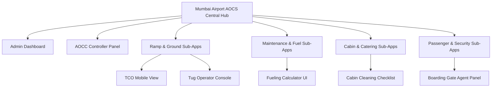
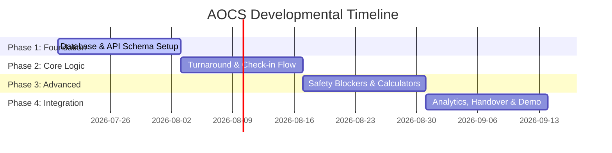

# Airport Operations Coordination System (AOCS)

## Initial Phase Project Handbook

### Course: Software Engineering

### Academic Year: 2026-2027

### Project Team Members

* **Krishna Solanki (I075) - Lead:** Backend, Architecture, Database

* **Anay Modi (I088):** Frontend, React, Dashboard, API Integration

* **Anuvrat Tripathi (I080):** Documentation, Testing, UML, Presentation

* **Chaitanya Tikku (I078):** Integration Specialist, Mobile HCI Developer & Quality Assurance

---

## 1. Introduction to Software Engineering

3

## 2. Why We Selected Aviation

4

## 3. Understanding Airport Operations

6

## 4. Existing Problems

8

## 5. Proposed Solution & Vision

# Project Vision: The Mega Web App Hub

This document defines the overarching design philosophy, software architecture, and final outcomes of the Airport Operations Coordination System (AOCS) project. It serves as a persistent context anchor for development.

---

## 1. Central Core Theme: "Communication, Communication, Communication"

At its heart, the AOCS is not just a database or a simple data tracker. It is a **real-time coordination and communication platform**. A successful aircraft turnaround depends on aligning:
* **Airplanes / Pilots:** Sharing fuel requirements, technical issues, and onboard readiness.
* **Ground Staff:** Cleaning, catering, baggage loaders, and water services executing physical tasks.
* **Airlines:** Dispatchers, passenger counts, and departure slots.
* **Air Traffic Control (ATC):** Runway slots, landing times, and gate clearance.

Every feature we develop must prioritize **instantaneous status visibility, rapid updates, and zero-miscommunication handovers** using live notifications and status toggles.

---

## 2. Architecture: Central Hub & Tunneled Sub-Apps

To support the 25 distinct user roles, the system is structured as a **Mega Web App** (modeled after a busy international terminal hub like Mumbai Airport) that tunnels into **25 specialized Human-Computer Interaction (HCI) views**.

### The "Tunneling" Concept
Rather than creating 25 separate disconnected web apps, we build one central React + Spring Boot application. Users log in through a single portal, and the system **tunnels** them to their custom HCI interface based on their role token.

---

## 3. Specialized HCI & UI Control Philosophy

Different operations require different interface paradigms:

### A. Simple Toggle & Status Switches (e.g., Cleaning, Security, Tug Operators)
* **Goal:** Zero distraction, fast input.
* **UI Controls:** Large toggle sliders or physical-style switches.
* **Behavior:** When a tug operator begins pushback, they flick a single "Pushback Toggle". This immediately sends a REST request to Spring Boot, updating the database and broadcasting a notification to the supervisor and ATC.

### B. Interactive Calculator UIs (e.g., Fueling Operators & Pilots)
* **Goal:** Mathematical accuracy and mutual verification.
* **Scenario:** The Pilot calculates required fuel based on cargo weight and flight path. The Fueling Operator calculates the density of the fuel batch. 
* **UI Controls:** An interactive fueling calculator panel where:
  * Pilot inputs: *Target Fuel Weight (kg)*.
  * Refueler inputs: *Current Fuel Volume (liters) & Fuel Density (kg/l)*.
  * System calculates: *Liters to pump = (Target - Current) / Density*.
  * Both users press verification toggles to lock the values before pumping begins.

### C. Live Timelines and Color-Coded Alerts (e.g., Ground Supervisors)
* **Goal:** Visual monitoring and exception handling.
* **UI Controls:** Gantt charts of turnaround timelines.
* **Behavior:** Tasks change color based on proximity to thresholds:
  * **Green:** Task is progressing on-time.
  * **Yellow:** Task is within 5 minutes of its scheduled limit but not completed.
  * **Red:** Task is delayed, flashing on the supervisor's dashboard and sending push alerts to the team lead.

---

## 4. Referencing this Vision for Future Development

When building code:
1. **Database Schema:** Tables must support timestamps for task status changes (`assigned_at`, `started_at`, `completed_at`) to enable the dashboard timeline calculations.
2. **API Design (Spring Boot):** We need WebSocket or Server-Sent Events (SSE) support alongside REST to push gate updates and delay alerts instantly to active UIs.
3. **Frontend Routing (React):** Define role-based router tunnels that direct users to their optimized HCI layouts immediately after authentication.

## 6. Airport Management & Usage Features

# AOCS: Airport Management & Usage Features (20 Core Features)

This document outlines the **20 distinct airport usage and management features** provided by the Airport Operations Coordination System (AOCS). These features focus on operational efficiency, airfield safety, resource allocation, and terminal management.

---

## 1. Airfield & Turnaround Coordination

### 1. Automated Turnaround Time (TAT) Monitor
* **Description:** A digital countdown clock that tracks turnaround activities (cleaning, refueling, catering, baggage) from the moment the aircraft parks (On-Block) until pushback (Off-Block).
* **Airport Benefit:** Prevents flight delays by visually highlighting which specific department is lagging behind, helping the airport maintain its on-time performance (OTP).

### 2. Stand & Gate Sizing Compatibility Matcher
* **Description:** A planning tool that verifies if an incoming aircraft's physical wingspan and length are compatible with the assigned stand dimensions before it lands.
* **Airport Benefit:** Prevents costly ramp gridlocks and safety incidents caused by trying to park large aircraft (like a Boeing 777) at narrow-body stands.

### 3. Cross-Department Turnaround Blocker (Safety Lockout)
* **Description:** A system rule that locks the boarding gate controls until the Cabin Cleaning Supervisor, Security Sweeper, and Line Maintenance Engineer submit their digital safety sign-offs.
* **Airport Benefit:** Guarantees that passengers never board an unclean, uninspected, or unsecured aircraft, enforcing absolute compliance with aviation security and safety laws.

### 4. Centralized Schedule Coordinator
* **Description:** A master schedule interface linked to Air Traffic Control (ATC) updates. Any change to a flight's ETA or ETD automatically shifts the deadlines of all ground tasks.
* **Airport Benefit:** Keeps the entire airport staff coordinated and prepared for sudden flight schedule changes without needing manual phone calls.

---

## 2. Resource & Equipment Management

### 5. Ground Fleet & Equipment Fleet Manager
* **Description:** A visual allocation board showing the active status and availability of airport ground equipment (fuel trucks, catering high-lifts, water carts, pushback tugs).
* **Airport Benefit:** Prevents delays by ensuring two flights at opposite ends of the terminal aren't scheduled to use the same refueling truck at the same time.

### 6. Crew Shuttle Bus & Transportation Dispatcher
* **Description:** Coordinates the dispatching of shuttle buses to transport flight crew and passengers from the terminal to remote aircraft parking stands.
* **Airport Benefit:** Prevents delays in boarding and crew boarding times for flights parked away from jet-bridges.

### 7. Aircraft Auxiliary Power (GPU/PCA) Utility Monitor
* **Description:** Tracks the usage and utility consumption of Ground Power Units (GPU) and Pre-Conditioned Air (PCA) supplied to the aircraft at each gate.
* **Airport Benefit:** Allows the airport to track electricity/utility usage per airline for precise utility billing.

---

## 3. Safety, Security & Emergency Operations

### 8. Instant Hazard & Emergency Dispatch Alarm
* **Description:** A priority broadcast system that sounds alarms in the airport fire and rescue station the moment a fuel spill or maintenance hazard is reported on the ramp.
* **Airport Benefit:** Shows precise stand coordinates and incident details instantly, enabling the fastest possible emergency response to prevent disasters on the airfield.

### 9. Foreign Object Debris (FOD) & Airfield Inspection Log
* **Description:** A digital logbook where airfield inspectors record the results of runway sweeps and detect runway damage or foreign objects.
* **Airport Benefit:** Prevents engine ingestion hazards and aircraft structural damage by verifying runway safety windows.

### 10. Dual-Verification Fueling Audit Panel
* **Description:** An interactive calculator where the pilot's requested fuel weight is reconciled and double-verified against the actual volume pumped by the ramp fuel operator.
* **Airport Benefit:** Eliminates human calculation errors during fueling and keeps a digital audit trail of exactly how much fuel was transferred to each airline.

### 11. Baggage & Cargo Manifest Reconciler
* **Description:** A counting check that requires the baggage loading supervisor to input the final bag count to verify it matches the counter's passenger manifest before departure.
* **Airport Benefit:** Prevents security risks (e.g., luggage flying without its passenger) and ensures the aircraft's weight and center of gravity are within safe flight parameters.

---

## 4. Terminal & Passenger Experience

### 12. Interactive Terminal Incident Tracker
* **Description:** A ticketing log where terminal managers report facility issues (e.g., broken escalators, gate jet-bridge failures, baggage belt breakdowns) with severity ratings and locations.
* **Airport Benefit:** Keeps airport infrastructure running smoothly by dispatching maintenance crews immediately, preserving passenger comfort and terminal flow.

### 13. Check-in Counter Allocation Planner
* **Description:** Dynamically maps and assigns physical check-in desks to airlines based on passenger loads and schedule.
* **Airport Benefit:** Maximizes terminal capacity and prevents overcrowding by distributing check-in lanes balanced across terminals.

### 14. Passenger Security Checkpoint Queue Balancer
* **Description:** Monitors wait times and queue lengths at security screening areas, alerting terminal managers when queues exceed 15 minutes.
* **Airport Benefit:** Improves passenger flow by prompting managers to open extra security screening lanes before bottlenecks occur.

### 15. Customs & Passport Control Queue Tracker
* **Description:** Monitors international arrival lanes and passenger processing times at immigration check-points.
* **Airport Benefit:** Helps airport duty managers allocate customs staff dynamically to match peak international arrivals.

### 16. Baggage Claim Carousel Assigner
* **Description:** Dynamically assigns arrival carousels to flights and automatically updates flight status displays in the baggage hall.
* **Airport Benefit:** Reduces passenger confusion and terminal congestion by directing arriving passengers to the correct carousel immediately.

### 17. VIP & CIP Lounge Occupancy Manager
* **Description:** Tracks live occupancy and entry control logs for premium airport lounges.
* **Airport Benefit:** Prevents lounge overcrowding and coordinates catering demands in premium passenger zones.

---

## 5. Operations Control & Administration

### 18. Runway Occupancy & Taxiway Traffic Monitor
* **Description:** A digital board showing runway closures, active taxiway blockages, and landing/take-off queues.
* **Airport Benefit:** Prevents runway incursions and allows the AOCC to re-route aircraft paths safely.

### 19. Shift Handover Bulletin Board
* **Description:** A specialized dashboard view showing all pending tasks, active terminal incidents, and delayed flights for the incoming shift of airport supervisors.
* **Airport Benefit:** Eliminates communication gaps during shift rotations, ensuring the new team knows exactly which planes or terminal areas need urgent attention.

### 20. Airport Performance Analytics (SLA Reports)
* **Description:** An analytics tool that generates reports on average turnaround durations, repeated delay reasons, and department response times.
* **Airport Benefit:** Gives airport management concrete data to review operational bottlenecks, renegotiate airline service levels, and improve overall airport capacity.

## 7. Master User Stories & Acceptance Criteria

## 2. Group A: System Administration & Control Center

### 1. Airport Administrator
* **User Story 1: Create Staff Accounts**  
  As an Airport Administrator, I want to create staff accounts so that authorized personnel can access the AOCS.  
  *Acceptance Criteria:*  
  * **Given** the administrator is logged in,  
  * **When** the admin submits the new user form (name, email, role, department),  
  * **Then** the system shall generate a unique User ID, assign default permissions, create the database record, and send activation credentials to the user's email.
* **User Story 2: Manage User Permissions**  
  As an Airport Administrator, I want to update user permissions so that employees only have access to features relevant to their roles.  
  *Acceptance Criteria:*  
  * **Given** a user profile is loaded on the screen,  
  * **When** the administrator adjusts specific permission checkboxes and clicks save,  
  * **Then** the system shall update the user's access token in real-time, write the old vs new permissions to the audit logs table, and apply the rules on the user's next API request.
* **User Story 3: View System Audit Logs**  
  As an Airport Administrator, I want to view system audit logs so that I can monitor all critical activities performed in the system.  
  *Acceptance Criteria:*  
  * **Given** the admin access is validated,  
  * **When** the admin accesses the audit log panel and applies filters (by User ID, Module, Date range),  
  * **Then** the system shall display the matching audit records showing timestamp, user IP, action type, and database change description.

### 2. AOCC Director (Airport Operations Control Center)
* **User Story 1: Monitor Airport Operations**  
  As an AOCC Director, I want to monitor airport-wide operational metrics so that I can ensure smooth airport operations.  
  *Acceptance Criteria:*  
  * **Given** the director's dashboard is active,  
  * **When** any operational event changes (e.g., flight landing, gate delay, incident),  
  * **Then** the system shall push real-time updates via WebSockets to automatically refresh charts, gate occupancy graphs, and flash alerts without manual reload.
* **User Story 2: Modify Flight Schedules**  
  As an AOCC Director, I want to update flight schedules so that airport operations remain coordinated during delays or emergencies.  
  *Acceptance Criteria:*  
  * **Given** a flight schedule exists in the database,  
  * **When** the director inputs a modified departure/arrival time (ETD/ETA),  
  * **Then** the system shall check for gate/runway scheduling conflicts, update the ETA/ETD across all client views, and recalculate dependent turnaround task deadlines.
* **User Story 3: Manage Runway Availability**  
  As an AOCC Director, I want to mark runways as available or unavailable so that aircraft operations remain safe.  
  *Acceptance Criteria:*  
  * **Given** a runway is active,  
  * **When** the director toggles the runway status to "Closed" due to maintenance or weather,  
  * **Then** the system shall flag a critical conflict on all incoming flights scheduled on that runway within the next 2 hours and notify the ATC and Stand Planner dashboards.

### 3. Gate & Stand Planner
* **User Story 1: Assign Gates**  
  As a Gate & Stand Planner, I want to assign gates to flights so that passengers can board and disembark efficiently.  
  *Acceptance Criteria:*  
  * **Given** a scheduled flight with a registered aircraft type is loaded,  
  * **When** the planner assigns a gate,  
  * **Then** the system shall verify the stand's physical sizing matches the aircraft wing-span and length parameters, reserve the stand, and publish the gate number to the flight timeline.
* **User Story 2: Allocate Aircraft Parking Stands**  
  As a Gate & Stand Planner, I want to assign parking stands to aircraft so that aircraft are parked safely after arrival.  
  *Acceptance Criteria:*  
  * **Given** an arriving aircraft,  
  * **When** the planner selects a stand from the interactive map,  
  * **Then** the system shall check that the stand status is "Unoccupied" at the landing time, lock the stand for the flight duration, and update the stand status to "Reserved".
* **User Story 3: Reassign Gates During Operational Changes**  
  As a Gate & Stand Planner, I want to change gate assignments so that operational disruptions can be managed efficiently.  
  *Acceptance Criteria:*  
  * **Given** a flight is parked or scheduled at Gate A1,  
  * **When** the planner reassigns the flight to Gate B3,  
  * **Then** the system shall release the reservation on Gate A1, block Gate B3, update the flight status, and broadcast a real-time "Gate Change Alert" to all ground staff assigned to that flight.

### 4. Ground Operations Supervisor
* **User Story 1: Assign Ground Handling Tasks**  
  As a Ground Operations Supervisor, I want to assign turnaround tasks to ground staff so that aircraft are serviced efficiently before departure.  
  *Acceptance Criteria:*  
  * **Given** a flight is marked "On-Block",  
  * **When** the supervisor selects turnaround tasks (cleaning, fueling, catering) and assigns them to department leads,  
  * **Then** the system shall set task statuses to "Pending", record the assignment, and notify the designated team leads.
* **User Story 2: Set Task Priorities**  
  As a Ground Operations Supervisor, I want to prioritize turnaround tasks so that critical activities are completed first.  
  *Acceptance Criteria:*  
  * **Given** multiple tasks are assigned,  
  * **When** the supervisor changes a task priority to "High" or "Critical",  
  * **Then** the system shall update the task priority in the database and automatically bump the task to the top of the assigned team member's mobile work queue.
* **User Story 3: Record Operational Delays**  
  As a Ground Operations Supervisor, I want to record delays in turnaround activities so that airport management can monitor operational performance.  
  *Acceptance Criteria:*  
  * **Given** a task has exceeded its scheduled completion window,  
  * **When** the supervisor enters the delay duration and select a standardized delay reason code,  
  * **Then** the system shall store the data, display a warning icon on the central dashboard, and recalculate the estimated departure time (ETD) for the flight.

---

## 3. Group B: Ramp & Turnaround Operations

### 5. Turnaround Coordinator (TCO / Red Cap)
* **User Story:**  
  As a Turnaround Coordinator, I want to record the start time of each ground handling activity on a mobile tablet so that I can monitor turnaround progress accurately.  
  *Acceptance Criteria 1 (Refueling Start Trigger):*  
  * **Given** that the aircraft is parked at the assigned stand, and the Ground Operations Supervisor has dispatched the refueling task,  
  * **When** the Turnaround Coordinator taps the "Start Refueling" button on the mobile tablet,  
  * **Then** the system shall record the current timestamp as "Refueling Started" and update the task status to "In Progress" in the database.
  *Acceptance Criteria 2 (Generic Activity Start):*  
  * **Given** that the flight turnaround checklist is loaded on the coordinator's terminal,  
  * **When** the coordinator selects an activity (e.g. cleaning, catering) from a pre-defined list and taps "Start",  
  * **Then** the system shall record the activity start time and update the flight turnaround timeline on the central dashboard.
  *Acceptance Criteria 3 (Dashboard Monitoring):*  
  * **Given** that multiple turnaround activities are in progress,  
  * **When** the coordinator views the turnaround dashboard screen,  
  * **Then** the system shall display the status (Pending, In Progress, Delayed, Completed) and elapsed duration for all active tasks.

### 6. Aircraft Marshaller
* **User Story:**  
  As an Aircraft Marshaller, I want to report the aircraft's On-Block time so that the AOCS can start the turnaround monitoring process.  
  *Acceptance Criteria 1 (Confirming On-Block):*  
  * **Given** that the aircraft has taxied to its assigned stand,  
  * **When** the marshaller confirms wheel chocks are placed by tapping the "Confirm On-Block" button on their terminal,  
  * **Then** the system shall record the current timestamp as the flight's "On-Block Time" in the database.
  *Acceptance Criteria 2 (Automatic Timer Activation):*  
  * **Given** that the On-Block time has been successfully saved in the database,  
  * **When** the AOCS registers this timestamp,  
  * **Then** the system shall automatically initialize the turnaround countdown timer for this flight.
  *Acceptance Criteria 3 (Visibility of On-Block Event):*  
  * **Given** that the flight is in "On-Block" status,  
  * **When** any authorized airport user (e.g., Ground Supervisor, Airline Representative) views the flight status screen,  
  * **Then** the system shall display the recorded On-Block timestamp and the active countdown timer.

### 7. Pushback Tug Operator
* **User Story:**  
  As a Pushback Tug Operator, I want to report the commencement of pushback so that stakeholders are informed that departure procedures have begun.  
  *Acceptance Criteria 1 (Starting Pushback):*  
  * **Given** that the flight status is "Ready for Pushback" (indicating all turnaround tasks are completed),  
  * **When** the tug operator engages the towbar and taps the "Commence Pushback" button on their screen,  
  * **Then** the system shall update the flight status to "Pushback Commenced" and record the "Off-Block" timestamp.
  *Acceptance Criteria 2 (Operational Notifications):*  
  * **Given** that the tug operator has submitted the "Pushback Commenced" status update,  
  * **When** the system receives the update,  
  * **Then** the system shall broadcast a real-time notification to the Air Traffic Control (ATC) dashboard and the Ground Operations Supervisor's dashboard.
  *Acceptance Criteria 3 (Movement Verification):*  
  * **Given** that the pushback event is recorded,  
  * **When** users view the flight movement details page,  
  * **Then** the system shall display the pushback start time and change the flight status from "On-Block" to "Departed".

### 8. Baggage Loading Supervisor
* **User Story:**  
  As a Baggage Loading Supervisor, I want to update baggage offload and onload status so that baggage handling progress can be monitored in real time.  
  *Acceptance Criteria 1 (Baggage Offload Start):*  
  * **Given** that the flight status is "On-Block",  
  * **When** the supervisor taps "Start Baggage Offloading" on their mobile device,  
  * **Then** the system shall update the task status to "Offloading In Progress" and display this status on the central dashboard.
  *Acceptance Criteria 2 (Baggage Onload Start):*  
  * **Given** that baggage offloading is completed,  
  * **When** the supervisor taps "Start Baggage Loading",  
  * **Then** the system shall update the status to "Loading In Progress" and display the target bag count from the check-in counter manifest.
  *Acceptance Criteria 3 (Completion & Count Validation):*  
  * **Given** that all baggage has been loaded,  
  * **When** the supervisor inputs the final count of loaded bags and taps "Complete Baggage Task",  
  * **Then** the system shall verify if the count matches the check-in count, store the final bag count, and mark the baggage task as "Completed".

### 9. Cargo Handling Specialist
* **User Story:**  
  As a Cargo Handling Specialist, I want to record commercial cargo loading activities so that cargo operations can be tracked efficiently.  
  *Acceptance Criteria 1 (Cargo Loading Start):*  
  * **Given** that the aircraft cargo doors are opened,  
  * **When** the specialist taps "Start Cargo Loading" and enters the container ID,  
  * **Then** the system shall set the cargo status to "Loading In Progress" and associate the container with the flight.
  *Acceptance Criteria 2 (Weight and Balance Logging):*  
  * **Given** that cargo items are being loaded,  
  * **When** the specialist enters the weight (in kg) of each loaded cargo pallet and submits the record,  
  * **Then** the system shall store the cargo weight data in the database and recalculate the flight's total cargo load.
  *Acceptance Criteria 3 (Cargo Completion):*  
  * **Given** that all cargo containers are loaded and locked,  
  * **When** the specialist clicks "Complete Cargo Operations",  
  * **Then** the system shall update the task status to "Completed" and notify the Ground Operations Supervisor that cargo is cleared.

---

## 4. Group C: Maintenance & Fueling Services

### 10. Line Maintenance Engineer
* **User Story 1: Perform Pre-flight Inspection**  
  As a Line Maintenance Engineer, I want to record the results of a pre-flight inspection so that the aircraft is confirmed safe for departure.  
  *Acceptance Criteria:*  
  * **Given** a flight turnaround checklist is loaded on the mobile terminal,  
  * **When** the engineer submits the inspection checklist,  
  * **Then** the system shall save the inspection status in the database, and if any defects are marked, automatically update the flight status to "Technical Issue" and block departure clearance.
* **User Story 2: Sign Technical Logbook**  
  As a Line Maintenance Engineer, I want to digitally sign the aircraft's technical logbook so that maintenance activities are officially documented.  
  *Acceptance Criteria:*  
  * **Given** all required maintenance checklist items are marked as completed,  
  * **When** the engineer inputs their secure 4-digit PIN to sign the logbook,  
  * **Then** the system shall store the encrypted signature and timestamp, lock the logbook to read-only status, and create an audit log entry.
* **User Story 3: Issue Maintenance Clearance**  
  As a Line Maintenance Engineer, I want to approve maintenance clearance so that the aircraft can proceed for boarding and departure.  
  *Acceptance Criteria:*  
  * **Given** that all inspections have passed and there are zero outstanding critical defect tickets on the aircraft,  
  * **When** the engineer clicks "Approve Maintenance Clearance",  
  * **Then** the system shall update the aircraft status to "Maintenance Cleared" and send an alert notification to the Ground Operations Supervisor and Boarding Gate Agent.

### 11. Avionics Technician
* **User Story 1: Record Electronic System Inspection**  
  As an Avionics Technician, I want to log inspection results of electronic systems so that all avionics components are verified before departure.  
  *Acceptance Criteria:*  
  * **Given** the aircraft avionics checklist is open,  
  * **When** the technician submits the inspection results,  
  * **Then** the system shall save the report, highlight failed systems in red on the maintenance panel, and notify the Line Maintenance Engineer of failures.
* **User Story 2: Report Electrical Faults**  
  As an Avionics Technician, I want to report electrical issues so that repairs can be scheduled immediately.  
  *Acceptance Criteria:*  
  * **Given** a defect has been identified during avionics inspection,  
  * **When** the technician submits a fault ticket with severity (Minor/Critical) and category,  
  * **Then** the system shall generate a unique defect ID, change the aircraft status to "Technical Issue", and display the ticket on the Maintenance Supervisor's work-list.
* **User Story 3: Request Technical Standby**  
  As an Avionics Technician, I want to request technical standby support so that additional assistance is available during complex repairs.  
  *Acceptance Criteria:*  
  * **Given** a repair ticket is active and requires secondary verification or support,  
  * **When** the technician taps "Request Standby Support" on their terminal,  
  * **Then** the system shall broadcast a priority alert to the Maintenance Control Team and update the ticket status to "Standby Requested".

### 12. Aviation Refuelling Operator
* **User Story 1: Record Fuel Quantity**  
  As an Aviation Refuelling Operator, I want to calculate and record the amount of fuel pumped into the aircraft so that fuel records remain accurate.  
  *Acceptance Criteria:*  
  * **Given** the pilot has submitted a target fuel load (in kg) and the Fuel Safety Inspector has approved clearance,  
  * **When** the operator inputs the actual fuel volume loaded (in liters) and the fuel density,  
  * **Then** the system shall compute the final fuel weight in kilograms, verify that it falls within ±1% of the pilot's target load, and store the quantity.
* **User Story 2: Mark Refueling Complete**  
  As an Aviation Refuelling Operator, I want to mark the refueling task as completed so that ground operations know the aircraft is ready for the next process.  
  *Acceptance Criteria:*  
  * **Given** the fueling hose is safely disconnected and fuel weights are saved,  
  * **When** the operator clicks "Refueling Completed",  
  * **Then** the system shall change the task status to "Completed", record the timestamp, and remove the refueling block from the Ground Operations Supervisor's dashboard.
* **User Story 3: View Assigned Refueling Tasks**  
  As an Aviation Refuelling Operator, I want to view my assigned refueling jobs so that I can complete them in the correct order.  
  *Acceptance Criteria:*  
  * **Given** the operator is logged into their mobile terminal,  
  * **When** they access the job queue,  
  * **Then** the system shall display all active refueling assignments sorted by flight schedule departure times, showing gate/stand location and target fuel requirements.

### 13. Fuel Safety Inspector
* **User Story 1: Record Fuel Quality Test**  
  As a Fuel Safety Inspector, I want to record fuel quality test results so that only approved fuel is supplied to aircraft.  
  *Acceptance Criteria:*  
  * **Given** chemical test samples have been drawn from the fuel batch,  
  * **When** the inspector inputs test parameters (water content, visual clarity, flashpoint) and submits,  
  * **Then** the system shall store the test record and flag the batch as "Pass" or "Fail".
* **User Story 2: Approve Refueling Safety Clearance**  
  As a Fuel Safety Inspector, I want to approve refueling safety clearance so that refueling can begin only after safety verification.  
  *Acceptance Criteria:*  
  * **Given** the fuel quality test has passed and the safety grounding cables are confirmed attached,  
  * **When** the inspector taps "Approve Refueling Safety Clearance" and enters their security PIN,  
  * **Then** the system shall record the safety token and unlock the refueling controls on the Refueling Operator's terminal.
* **User Story 3: Reject Unsafe Fuel**  
  As a Fuel Safety Inspector, I want to reject unsafe fuel batches so that contaminated fuel is not used in aircraft.  
  *Acceptance Criteria:*  
  * **Given** a fuel quality test has failed,  
  * **When** the inspector clicks "Reject Batch",  
  * **Then** the system shall set the batch status to "Contaminated", trigger a high-severity alert to the AOCC, and programmatically lock the refueling task for the affected flight.

---

## 5. Group D: Cabin & Catering Services

### 14. Cabin Cleaning Supervisor
* **User Story: Assign Cleaning Zones**  
  As a Cabin Cleaning Supervisor, I want to assign cleaning zones to available cabin crew members, so that the aircraft cabin is cleaned, checked, and ready for passenger boarding on time.  
  *Acceptance Criteria 1 (Successful Assignment):*  
  * **Given** that the aircraft has parked at the stand and passenger deboarding is complete,  
  * **And** the cabin cleaning crew members are marked as "Available" in the system,  
  * **When** the supervisor assigns a specific cabin cleaning zone to a crew member,  
  * **Then** the system shall change the assignment status to "Assigned" and send a notification to the assigned crew member's mobile interface.
  *Acceptance Criteria 2 (Crew Member Busy Conflict):*  
  * **Given** that a cabin cleaning crew member is already assigned to active work on another aircraft,  
  * **When** the supervisor attempts to assign them to a new flight,  
  * **Then** the system shall display a warning message "Crew member is currently busy" and block the assignment.

### 15. Cabin Cleaning Crew Member
* **User Story: Complete Cleaning Checklist**  
  As a Cabin Cleaning Crew Member, I want to mark my cleaning task checklist as completed on my mobile device, so that the supervisor is notified and the aircraft can be cleared for boarding.  
  *Acceptance Criteria 1 (Successful Checklist Completion):*  
  * **Given** that the cleaning task is currently marked as "In Progress",  
  * **And** all mandatory checklist items (vacuuming, trash removal, tray table sanitation) are checked off,  
  * **When** the crew member clicks "Submit Completion",  
  * **Then** the system shall update the task status to "Completed" and log the timestamp.
  *Acceptance Criteria 2 (Incomplete Checklist Prevention):*  
  * **Given** that one or more mandatory cleaning checklist items are left unchecked,  
  * **When** the crew member attempts to click "Submit Completion",  
  * **Then** the system shall display an error message "Cannot complete task: Checklist items pending" and keep the task "In Progress".

### 16. Catering Dispatcher
* **User Story: Sync Meal Requirements**  
  As a Catering Dispatcher, I want to sync meal requirements with passenger manifests, so that I can prepare the correct quantity and type of meal carts.  
  *Acceptance Criteria 1 (Successful Manifest Sync):*  
  * **Given** that the airline system is online and sending live passenger data,  
  * **When** the dispatcher requests passenger count updates for an outbound flight,  
  * **Then** the system shall compute the correct count of special and standard meals and generate the meal preparation sheet.
  *Acceptance Criteria 2 (System Connection Error):*  
  * **Given** that the external airline manifest system is offline,  
  * **When** the dispatcher attempts to retrieve passenger counts,  
  * **Then** the system shall show a connection warning alert and default to the maximum aircraft passenger capacity list.

### 17. Catering Loader
* **User Story: Log Galley Loading Completion**  
  As a Catering Loader, I want to log the completion of galley cart loading at the aircraft door, so that the cabin is stocked and the galley doors can be closed for flight departure.  
  *Acceptance Criteria 1 (Successful Loading):*  
  * **Given** that the catering high-lift truck is docked at the galley door,  
  * **When** the loader marks "Catering Exchange Completed" in the app,  
  * **Then** the system shall update the flight catering task status to "Completed" and notify the Turnaround Coordinator (TCO).
  *Acceptance Criteria 2 (Unsafe Truck Docking Prevention):*  
  * **Given** that the high-lift truck safety locks are not engaged,  
  * **When** the loader attempts to mark "Catering Exchange Completed",  
  * **Then** the system shall display a safety warning "Engage vehicle safety locks to continue" and block the completion status update.

### 18. Water & Lavatory Service Operator
* **User Story: Submit Servicing Volumes**  
  As a Water & Lavatory Service Operator, I want to submit waste drainage and water replenishment volumes, so that the aircraft is serviced for passenger comfort.  
  *Acceptance Criteria 1 (Successful Servicing):*  
  * **Given** that the service vehicle is parked at the aircraft utility panel,  
  * **When** the operator completes servicing and inputs the volume of water filled (in liters),  
  * **Then** the system shall update the utility task to "Completed" and record the quantity and timestamp in the database.
  *Acceptance Criteria 2 (Missing Volume Input):*  
  * **Given** that the operator clicks "Complete Task" without inputting water volume,  
  * **When** they submit the form,  
  * **Then** the system shall display a validation error "Please enter the water volume filled".

---

## 6. Group E: Passenger & Terminal Services

### 19. Check-in Counter Agent
* **User Story: Monitor Passenger Check-in**  
  As a Check-in Counter Agent, I want to monitor passenger check-in status so that I can ensure all travelers are processed before departure.  
  *Acceptance Criteria 1 (Passenger Check-in Update):*  
  * **Given** that the check-in counter is open for a flight,  
  * **When** the agent scans a passenger's passport/barcode or manually submits their details,  
  * **Then** the system shall update the individual passenger's status to "Checked-in" and update the flight's passenger manifest in the database.
  *Acceptance Criteria 2 (Real-time Manifest Progress):*  
  * **Given** that check-in is ongoing,  
  * **When** the agent views the flight overview screen,  
  * **Then** the system shall display the live ratio of checked-in passengers to booked passengers (e.g., 142 / 150 checked-in).
  *Acceptance Criteria 3 (Closing Check-in):*  
  * **Given** that the check-in closure deadline is reached,  
  * **When** the agent clicks the "Close Check-in" button,  
  * **Then** the system shall change the flight's check-in status to "Closed", generate the final passenger manifest, and transmit the final load numbers to the Catering Dispatcher and Boarding Gate Agent.

### 20. Boarding Gate Agent
* **User Story: Update Boarding Milestones**  
  As a Boarding Gate Agent, I want to update boarding milestones such as "Boarding Started", "Final Call", and "Boarding Closed" so that operational teams receive real-time passenger status updates.  
  *Acceptance Criteria 1 (Boarding Start Dependency):*  
  * **Given** that the aircraft cabin is marked as "Completed" by the Cabin Cleaning Supervisor, and "Cleared" by the Aircraft Security Sweeper, and "Certified Safe" by the Line Maintenance Engineer,  
  * **When** the gate agent taps the "Start Boarding" button,  
  * **Then** the system shall change the flight boarding status to "Boarding Started" and broadcast a boarding notification to all system monitors.
  *Acceptance Criteria 2 (Final Call Milestone):*  
  * **Given** that boarding is underway and there are remaining unboarded passengers,  
  * **When** the agent clicks the "Trigger Final Call" button,  
  * **Then** the system shall update the flight status to "Final Call" and display a warning on terminal screens.
  *Acceptance Criteria 3 (Boarding Closed Validation):*  
  * **Given** that all checked-in passengers are accounted for (either boarded or marked as no-show),  
  * **When** the agent clicks "Complete Boarding",  
  * **Then** the system shall change the boarding status to "Closed", update the flight status to "Ready for Pushback", and notify the Ground Operations Supervisor and Pushback Tug Operator.

### 21. Terminal Manager
* **User Story: Report Terminal Incidents**  
  As a Terminal Manager, I want to report terminal incidents such as power failures and escalator breakdowns so that airport operations can respond quickly.  
  *Acceptance Criteria 1 (Logging Incidents):*  
  * **When** the Terminal Manager logs a new incident by selecting the location, severity (Low, Medium, Critical), and description,  
  * **Then** the system shall save the incident, assign a unique tracking ID, and record the current timestamp.
  *Acceptance Criteria 2 (Escalation & Notification):*  
  * **Given** that a critical incident is logged,  
  * **When** the manager submits the report,  
  * **Then** the system shall immediately broadcast an emergency alert to the Airport Operations Control Center (AOCC) and the relevant maintenance team dashboard.
  *Acceptance Criteria 3 (Resolution Sign-off):*  
  * **Given** that an incident is marked as active,  
  * **When** the Terminal Manager inputs the repair details and clicks "Mark Resolved",  
  * **Then** the system shall set the status to "Resolved", save the resolution details, and clear the active alert from dashboards.

---

## 7. Group F: Security, Regulatory & Emergency Teams

### 22. Terminal Security Officer
* **User Story: Monitor Checkpoint Wait Times**  
  As a Terminal Security Officer, I want to monitor passenger queue wait times at terminal screening checkpoints, so that I can request additional screening lanes if wait times cross the 15-minute threshold.  
  *Acceptance Criteria 1 (Congestion Alert Triggered):*  
  * **Given** that passenger check-in sensors register a wait time of 16 minutes,  
  * **When** the system recalculates the checkpoint metrics,  
  * **Then** the system shall change the queue status to "Red" and send a notification to the Terminal Manager.
  *Acceptance Criteria 2 (Normal Operations):*  
  * **Given** that wait times are at 10 minutes,  
  * **When** the system updates wait metrics,  
  * **Then** the status remains "Green" and no alerts are generated.

### 23. Aircraft Security Sweeper
* **User Story: Sign-off Cabin Security Clearance**  
  As an Aircraft Security Sweeper, I want to sign off the aircraft cabin security checklist using a secure PIN, so that the aircraft is certified safe and passengers are authorized to board.  
  *Acceptance Criteria 1 (Successful Security Sign-off):*  
  * **Given** that all cabin security checklist zones (overhead bins, under-seat areas, lavatory panels) are marked "Clean & Clear",  
  * **When** the sweeper inputs their correct 4-digit security PIN and submits,  
  * **Then** the system shall update the flight cabin security status to "Cleared" and unlock the Boarding Gate UI to allow passenger boarding to begin.
  *Acceptance Criteria 2 (Invalid Security PIN):*  
  * **Given** that the sweeper inputs an incorrect security PIN,  
  * **When** they click submit,  
  * **Then** the system shall show a "PIN Verification Failed" error and keep the boarding gate locked.

### 24. Customs & Immigration Officer
* **User Story: View Arrival Timelines**  
  As a Customs & Immigration Officer, I want to view international arrivals timelines and passenger origins on my terminal, so that I can coordinate staffing for processing passport controls during peak hours.  
  *Acceptance Criteria 1 (Flight Arrival List Populated):*  
  * **Given** that international flights are scheduled to arrive,  
  * **When** the officer opens the immigration dashboard,  
  * **Then** the system shall display a table of flights with flight number, origin, ETA, and passenger counts.
  *Acceptance Criteria 2 (No Flight Scheduled):*  
  * **Given** that there are no arriving international flights within the next 3 hours,  
  * **When** the officer opens the dashboard,  
  * **Then** the system shall display the message "No international arrivals scheduled in the current window".

### 25. Airport Emergency Services Liaison (Fire/Rescue)
* **User Story: Receive Emergency Alarms**  
  As an Airport Emergency Services Liaison, I want to receive instant audible and visual alerts for refueling spills or aircraft alerts, so that fire and rescue crews can dispatch to the exact stand coordinates immediately.  
  *Acceptance Criteria 1 (Emergency Alert Broadcast):*  
  * **Given** that the Ground Supervisor or Fuel Safety Inspector triggers a "Fuel Leak Alarm" at Stand A4,  
  * **When** the alarm signal is registered in AOCS,  
  * **Then** the system shall sound a continuous siren alert on the emergency services terminal and display a flashing stand layout map showing Stand A4 coordinates.
  *Acceptance Criteria 2 (Emergency Incident Resolved):*  
  * **Given** that the incident has been neutralized by fire crews,  
  * **When** the liaison enters the safety resolution code,  
  * **Then** the system shall silence the alarm and update the stand status back to "Operational".

## 8. Non-Functional Requirements

15

## 9. Technology Stack

18

## 10. Database Overview

21

## 11. Project Development Roadmap & Workload Allocation

# AOCS: Project Development Roadmap & Feature Allocation

This document defines the 8-week developmental roadmap, team member responsibilities, workload distribution, and phase-by-phase execution plan for building the Airport Operations Coordination System (AOCS) from ground zero.

The workload is balanced to keep the core architectural and algorithmic features with **Krishna (Lead)** and **Anuvrat**, while assigning simpler CRUD-based and frontend-focused features to **Anay** and **Chaitanya** to prevent development bottlenecks.

---

## 1. Feature Allocation (6 / 6 / 4 / 4 Division)

### 💻 Krishna Solanki (Lead - Exactly 6 Features - Architectural & Core Logic)
*Workload: Heavy. Focuses on system state-machine, calculations, and real-time triggers.*
1. **Feature 3: Cross-Department Turnaround Blocker (Safety Lockout):** Backend validation preventing boarding gates from unlocking until cleaning, security, and maintenance sign-offs are submitted.
2. **Feature 1: Automated Turnaround Time (TAT) Monitor:** Dynamic timeline and countdown clock for parked flights.
3. **Feature 8: Instant Hazard & Emergency Dispatch Alarm:** WebSockets broadcast, audio alarms, and flashing stand coordinate maps for the fire rescue station.
4. **Feature 10: Dual-Verification Fueling Audit Panel:** Verification calculator converting fuel volume to weight ($Volume \times Density$) matching pilot and operator requests.
5. **Feature 4: Centralized Schedule Coordinator:** Real-time scheduler shifting task deadlines when flight ETA/ETD changes.
6. **Feature 2: Stand & Gate Sizing Compatibility Matcher:** Wing-span and length matching algorithm to prevent gate parking errors.

---

### 📝 Anuvrat Tripathi (Exactly 6 Features - Analytical & Verification)
*Workload: Heavy. Focuses on data processing, logs, and analytics.*
7. **Feature 11: Baggage & Cargo Manifest Reconciler:** Validates bag count and container weights against passenger check-in totals.
8. **Feature 20: Airport Performance Analytics (SLA Reports):** Performance analytics engine compiling delay root-causes and response times (PDF output).
9. **Feature 9: Foreign Object Debris (FOD) & Airfield Inspection Log:** Digital runway sweep inspection logger.
10. **Feature 5: Ground Fleet & Equipment Fleet Manager:** Vehicle scheduling and double-booking checks.
11. **Feature 6: Crew Shuttle Bus & Transportation Dispatcher:** Dispatch log for remote parking stand shuttle transports.
12. **Feature 18: Runway Occupancy & Taxiway Traffic Monitor:** Live traffic queue and closure status dashboard.

---

### 👨‍💻 Anay Modi (Exactly 4 Features - Simple & Frontend CRUD)
*Workload: Light. Focuses on simple UI layouts and basic forms.*
13. **Feature 12: Interactive Terminal Incident Tracker:** Ticket management and SLA tracking for terminal maintenance issues.
14. **Feature 13: Check-in Counter Allocation Planner:** Simple interface mapping airlines to desk numbers (basic CRUD).
15. **Feature 19: Shift Handover Bulletin Board:** Read-only log showing handover notes, active flights, and alerts.
16. **Feature 7: Aircraft Auxiliary Power (GPU/PCA) Utility Monitor:** Numerical form to log power consumption per flight for billing.

---

### 💻 Chaitanya Tikku (Exactly 4 Features - Simple & Frontend CRUD)
*Workload: Light. Focuses on simple selectors and display boards.*
17. **Feature 14: Passenger Security Checkpoint Queue Balancer:** Basic lane check dashboard and manual toggle for queue lanes.
18. **Feature 15: Customs & Passport Control Queue Tracker:** Dashboard table displaying international arrivals passenger list.
19. **Feature 16: Baggage Claim Carousel Assigner:** Simple dropdown interface to assign a belt number to incoming flights.
20. **Feature 17: VIP & CIP Lounge Occupancy Manager:** Incremental counter tracking lounge guest totals.

---

## 2. 4-Phase Building Roadmap (From Ground Zero)

### Phase 1: Database & Architectural Foundation (Weeks 1-2)
* **Objective:** Establish the repository, PostgreSQL tables, basic Spring Boot routes, and React layout shell.
* **Workload Division:**
  * **Krishna (Lead):** Sets up database schema, foreign keys, and Spring Boot project structure.
  * **Anuvrat:** Documents the database tables, relations, and drafts initial API specifications.
  * **Anay:** Creates standard UI elements (buttons, layout cards, header styling).
  * **Chaitanya:** Sets up Spring Security and defines user roles access endpoints.

### Phase 2: Core Turnaround & Terminal Services (Weeks 3-4)
* **Objective:** Build standard CRUD operations and simple dashboards for flights, check-ins, and task lists.
* **Workload Division:**
  * **Krishna:** Implements main flight timeline endpoints and gate scheduler views (Features 1 & 2).
  * **Anuvrat:** Implements vehicle assignment API and runway traffic queues dashboard (Features 5 & 18).
  * **Anay:** Implements the Check-in counter assignment and Incident tracker screens (Features 13 & 12).
  * **Chaitanya:** Implements the Carousel selector page and lounge entry buttons (Features 16 & 17).

### Phase 3: Advanced Algorithmic Logic & Safety Blockers (Weeks 5-6)
* **Objective:** Code the complex operational dependencies, calculator logic, and emergency sirens.
* **Workload Division:**
  * **Krishna:** Codes the **Feature 3 Safety Lockout** backend validation, **Feature 10 Fueling Calculator** logic, and **Feature 8 Emergency Alarm system** (including WebSockets push notification).
  * **Anuvrat:** Codes **Feature 11 Baggage Manifest Reconciler** and coordinates manual unit testing.
  * **Anay:** Integrates **Feature 7 GPU Power Utility Monitor** form.
  * **Chaitanya:** Integrates **Feature 14 Security Queue Balancer** and **Feature 15 Customs Queue displays**.

### Phase 4: Integration, Analytics & Final Handover (Weeks 7-8)
* **Objective:** Polish and connect all components, implement reporting engines, and prepare final evaluations.
* **Workload Division:**
  * **Anuvrat:** Builds **Feature 20 SLA Performance Reports** (generating PDF exports) and runs end-to-end testing cases.
  * **Krishna:** Integrates **Feature 4 Schedule Coordinator** logic, oversees build validation, and sets up sample demo flight datasets.
  * **Anay:** Customizes **Feature 19 Shift Handover Board** views.
  * **Chaitanya:** Conducts UI responsiveness checks.

## 12. Risks and Challenges

26

## 13. Future Enhancements

27

## 14. Glossary

28
