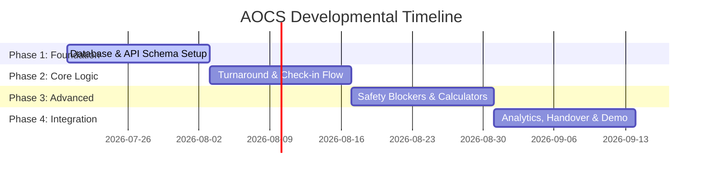

# AOCS: Project Development Roadmap & Feature Allocation

This document defines the 8-week developmental roadmap, team member responsibilities, workload distribution, and phase-by-phase execution plan for building the Airport Operations Coordination System (AOCS) from ground zero.

The workload is balanced to keep the core architectural and algorithmic features with **Krishna (Lead)** and **Anuvrat**, while assigning simpler CRUD-based and frontend-focused features to **Anay** and **Chaitanya** to prevent development bottlenecks.

---

## 1. Feature Allocation (6 / 6 / 4 / 4 Division)

### 💻 Krishna Solanki (Lead - Exactly 6 Features - Architectural & Core Logic)
*Workload: Heavy. Focuses on system state-machine, calculations, and real-time triggers.*
1. **Feature 3: Cross-Department Turnaround Blocker (Safety Lockout):** Backend validation preventing boarding gates from unlocking until cleaning, security, and maintenance sign-offs are submitted.
2. **Feature 1: Automated Turnaround Time (TAT) Monitor:** Dynamic timeline and countdown clock for parked flights.
3. **Feature 8: Instant Hazard & Emergency Dispatch Alarm:** WebSockets broadcast, audio alarms, and flashing stand coordinate maps for the fire rescue station.
4. **Feature 10: Dual-Verification Fueling Audit Panel:** Verification calculator converting fuel volume to weight ($Volume \times Density$) matching pilot and operator requests.
5. **Feature 4: Centralized Schedule Coordinator:** Real-time scheduler shifting task deadlines when flight ETA/ETD changes.
6. **Feature 2: Stand & Gate Sizing Compatibility Matcher:** Wing-span and length matching algorithm to prevent gate parking errors.

---

### 📝 Anuvrat Tripathi (Exactly 6 Features - Analytical & Verification)
*Workload: Heavy. Focuses on data processing, logs, and analytics.*
7. **Feature 11: Baggage & Cargo Manifest Reconciler:** Validates bag count and container weights against passenger check-in totals.
8. **Feature 20: Airport Performance Analytics (SLA Reports):** Performance analytics engine compiling delay root-causes and response times (PDF output).
9. **Feature 9: Foreign Object Debris (FOD) & Airfield Inspection Log:** Digital runway sweep inspection logger.
10. **Feature 5: Ground Fleet & Equipment Fleet Manager:** Vehicle scheduling and double-booking checks.
11. **Feature 6: Crew Shuttle Bus & Transportation Dispatcher:** Dispatch log for remote parking stand shuttle transports.
12. **Feature 18: Runway Occupancy & Taxiway Traffic Monitor:** Live traffic queue and closure status dashboard.

---

### 👨‍💻 Anay Modi (Exactly 4 Features - Simple & Frontend CRUD)
*Workload: Light. Focuses on simple UI layouts and basic forms.*
13. **Feature 12: Interactive Terminal Incident Tracker:** Ticket management and SLA tracking for terminal maintenance issues.
14. **Feature 13: Check-in Counter Allocation Planner:** Simple interface mapping airlines to desk numbers (basic CRUD).
15. **Feature 19: Shift Handover Bulletin Board:** Read-only log showing handover notes, active flights, and alerts.
16. **Feature 7: Aircraft Auxiliary Power (GPU/PCA) Utility Monitor:** Numerical form to log power consumption per flight for billing.

---

### 💻 Chaitanya Tikku (Exactly 4 Features - Simple & Frontend CRUD)
*Workload: Light. Focuses on simple selectors and display boards.*
17. **Feature 14: Passenger Security Checkpoint Queue Balancer:** Basic lane check dashboard and manual toggle for queue lanes.
18. **Feature 15: Customs & Passport Control Queue Tracker:** Dashboard table displaying international arrivals passenger list.
19. **Feature 16: Baggage Claim Carousel Assigner:** Simple dropdown interface to assign a belt number to incoming flights.
20. **Feature 17: VIP & CIP Lounge Occupancy Manager:** Incremental counter tracking lounge guest totals.

---

## 2. 4-Phase Building Roadmap (From Ground Zero)

### Phase 1: Database & Architectural Foundation (Weeks 1-2)
* **Objective:** Establish the repository, PostgreSQL tables, basic Spring Boot routes, and React layout shell.
* **Workload Division:**
  * **Krishna (Lead):** Sets up database schema, foreign keys, and Spring Boot project structure.
  * **Anuvrat:** Documents the database tables, relations, and drafts initial API specifications.
  * **Anay:** Creates standard UI elements (buttons, layout cards, header styling).
  * **Chaitanya:** Sets up Spring Security and defines user roles access endpoints.

### Phase 2: Core Turnaround & Terminal Services (Weeks 3-4)
* **Objective:** Build standard CRUD operations and simple dashboards for flights, check-ins, and task lists.
* **Workload Division:**
  * **Krishna:** Implements main flight timeline endpoints and gate scheduler views (Features 1 & 2).
  * **Anuvrat:** Implements vehicle assignment API and runway traffic queues dashboard (Features 5 & 18).
  * **Anay:** Implements the Check-in counter assignment and Incident tracker screens (Features 13 & 12).
  * **Chaitanya:** Implements the Carousel selector page and lounge entry buttons (Features 16 & 17).

### Phase 3: Advanced Algorithmic Logic & Safety Blockers (Weeks 5-6)
* **Objective:** Code the complex operational dependencies, calculator logic, and emergency sirens.
* **Workload Division:**
  * **Krishna:** Codes the **Feature 3 Safety Lockout** backend validation, **Feature 10 Fueling Calculator** logic, and **Feature 8 Emergency Alarm system** (including WebSockets push notification).
  * **Anuvrat:** Codes **Feature 11 Baggage Manifest Reconciler** and coordinates manual unit testing.
  * **Anay:** Integrates **Feature 7 GPU Power Utility Monitor** form.
  * **Chaitanya:** Integrates **Feature 14 Security Queue Balancer** and **Feature 15 Customs Queue displays**.

### Phase 4: Integration, Analytics & Final Handover (Weeks 7-8)
* **Objective:** Polish and connect all components, implement reporting engines, and prepare final evaluations.
* **Workload Division:**
  * **Anuvrat:** Builds **Feature 20 SLA Performance Reports** (generating PDF exports) and runs end-to-end testing cases.
  * **Krishna:** Integrates **Feature 4 Schedule Coordinator** logic, oversees build validation, and sets up sample demo flight datasets.
  * **Anay:** Customizes **Feature 19 Shift Handover Board** views.
  * **Chaitanya:** Conducts UI responsiveness checks.
