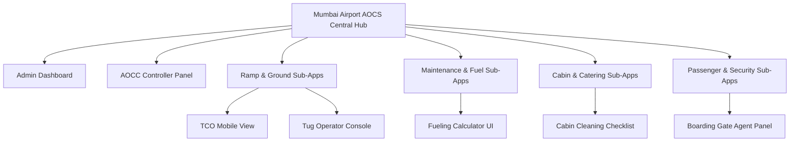

# Project Vision: The Mega Web App Hub

This document defines the overarching design philosophy, software architecture, and final outcomes of the Airport Operations Coordination System (AOCS) project. It serves as a persistent context anchor for development.

---

## 1. Central Core Theme: "Communication, Communication, Communication"

At its heart, the AOCS is not just a database or a simple data tracker. It is a **real-time coordination and communication platform**. A successful aircraft turnaround depends on aligning:
* **Airplanes / Pilots:** Sharing fuel requirements, technical issues, and onboard readiness.
* **Ground Staff:** Cleaning, catering, baggage loaders, and water services executing physical tasks.
* **Airlines:** Dispatchers, passenger counts, and departure slots.
* **Air Traffic Control (ATC):** Runway slots, landing times, and gate clearance.

Every feature we develop must prioritize **instantaneous status visibility, rapid updates, and zero-miscommunication handovers** using live notifications and status toggles.

---

## 2. Architecture: Central Hub & Tunneled Sub-Apps

To support the 25 distinct user roles, the system is structured as a **Mega Web App** (modeled after a busy international terminal hub like Mumbai Airport) that tunnels into **25 specialized Human-Computer Interaction (HCI) views**.

### The "Tunneling" Concept
Rather than creating 25 separate disconnected web apps, we build one central React + Spring Boot application. Users log in through a single portal, and the system **tunnels** them to their custom HCI interface based on their role token.

---

## 3. Specialized HCI & UI Control Philosophy

Different operations require different interface paradigms:

### A. Simple Toggle & Status Switches (e.g., Cleaning, Security, Tug Operators)
* **Goal:** Zero distraction, fast input.
* **UI Controls:** Large toggle sliders or physical-style switches.
* **Behavior:** When a tug operator begins pushback, they flick a single "Pushback Toggle". This immediately sends a REST request to Spring Boot, updating the database and broadcasting a notification to the supervisor and ATC.

### B. Interactive Calculator UIs (e.g., Fueling Operators & Pilots)
* **Goal:** Mathematical accuracy and mutual verification.
* **Scenario:** The Pilot calculates required fuel based on cargo weight and flight path. The Fueling Operator calculates the density of the fuel batch. 
* **UI Controls:** An interactive fueling calculator panel where:
  * Pilot inputs: *Target Fuel Weight (kg)*.
  * Refueler inputs: *Current Fuel Volume (liters) & Fuel Density (kg/l)*.
  * System calculates: *Liters to pump = (Target - Current) / Density*.
  * Both users press verification toggles to lock the values before pumping begins.

### C. Live Timelines and Color-Coded Alerts (e.g., Ground Supervisors)
* **Goal:** Visual monitoring and exception handling.
* **UI Controls:** Gantt charts of turnaround timelines.
* **Behavior:** Tasks change color based on proximity to thresholds:
  * **Green:** Task is progressing on-time.
  * **Yellow:** Task is within 5 minutes of its scheduled limit but not completed.
  * **Red:** Task is delayed, flashing on the supervisor's dashboard and sending push alerts to the team lead.

---

## 4. Referencing this Vision for Future Development

When building code:
1. **Database Schema:** Tables must support timestamps for task status changes (`assigned_at`, `started_at`, `completed_at`) to enable the dashboard timeline calculations.
2. **API Design (Spring Boot):** We need WebSocket or Server-Sent Events (SSE) support alongside REST to push gate updates and delay alerts instantly to active UIs.
3. **Frontend Routing (React):** Define role-based router tunnels that direct users to their optimized HCI layouts immediately after authentication.
