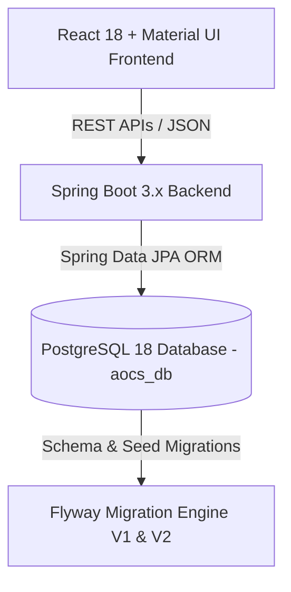

# ✈️ Saphire Airport Operations Coordination System (AOCS)

[](https.spring.io)
[](https://www.postgresql.org)
[](https://reactjs.org)
[](https://flywaydb.org)

**Saphire Airport Operations Coordination System (AOCS)** is an enterprise-grade full-stack web application designed to digitize, monitor, and optimize real-time aircraft turnaround activities (landing to departure) at **Saphire International Airport (IATA: SPH, ICAO: VASP)**.

> [!IMPORTANT]
> **Scope & Hub Constraint**: This is an internal operational coordination platform for airport ground staff (not a passenger ticket booking system). All tracked flights strictly adhere to the **Saphire Hub Constraint**: every flight must either originate at Saphire Airport (`origin = SPH`) or terminate at Saphire Airport (`destination = SPH`).

---

## 👥 Team Roles & Responsibilities

| Team Member | Project Role | Technical Deliverables & Primary Ownership |
| :--- | :--- | :--- |
| **Anuvrat Tripathi** | **Frontend UI/UX Lead** *(React + Material UI)* | 15+ Web pages, Material UI component library, real-time dashboard grid, and responsive styling. |
| **Anay Modi** | **Backend API & Logic Lead** *(Java Spring Boot)* | REST Controllers (`/api/flights`, `/api/tasks`), Service business rules, turnaround state engine, and Spring Security (RBAC). |
| **Krishna Solanki** | **Database & System Integration Lead** | Database schema, Flyway migrations (`V1`, `V2`), 17 JPA Entities, 16 Spring Data Repositories, and DB-to-API integration. |
| **Chaitanya Tikku** | **Documentation, UML & QA Testing Lead** | Software Requirement Specification (SRS), ER & Sequence Diagrams, Postman API Test Suite, User Manual, & Final PPT presentation. |

---

## 📂 Documentation & Specifications Directory

All project specifications and design documents are located under `documentation/MD/`:

* 📘 **Anay's Technical Handoff Guide**: [`Anay_Technical_Handoff_Guide.md`](documentation/MD/Anay_Technical_Handoff_Guide.md) *(Exhaustive guide explaining the project, entities, repositories, and backend roadmap)*
* ✈️ **Saphire Hub Architecture**: [`saphire_hub_architecture.md`](documentation/MD/saphire_hub_architecture.md) *(Home hub routing constraints & SQL check rules)*
* 📊 **ER Diagram & Schema**: [`ER_Diagram_Design.md`](documentation/MD/database_creation/ER_Diagram_Design.md) *(Complete 38-table relational schema)*
* ⚡ **Non-Functional Requirements**: [`non_functional_requirements.md`](documentation/MD/non_functional_requirements.md) *(Performance, fuel tolerance ±1%, passport masking, & audit rules)*
* 👥 **Team Role Breakdown**: [`roles.MD`](documentation/MD/project_discussion/team_assignments.md) *(Official team ownership matrix)*
* 📋 **Academic Project Guidelines**: [`instruction.md`](instruction.md) *(Professor's evaluation criteria & deadlines)*

---

## 🏗️ System Architecture & Tech Stack



### 1. Database & Data Access Layer (Completed ✅)
* **Database**: PostgreSQL 18 with 38 normalized tables.
* **Flyway Migrations**:
  * `db/migration/V1__initial_schema.sql` (Master schema creation & constraints)
  * `db/migration/V2__seed_data.sql` (7,000+ seed data rows centered around Saphire Airport SPH)
* **17 JPA Entities** (`com.saphire.aocs.entity`): `Flight`, `TurnaroundTask`, `FuelRequest`, `PassengerManifest`, `Airport`, `Airline`, `AircraftType`, `Aircraft`, `Gate`, `Stand`, `Role`, `Department`, `User`, `DelayLog`, `DelayLogId`, `AuditLog`, `Notification`.
* **16 Spring Data Repositories** (`com.saphire.aocs.repository`): `FlightRepository`, `TaskRepository`, `GateRepository`, `UserRepository`, `FuelRequestRepository`, `PassengerManifestRepository`, etc.

---

## ⚡ Getting Started (Local Development)

### 1. Database & Backend Setup
1. Ensure PostgreSQL 18 is running locally:
   ```bash
   createdb aocs_db
   ```
2. Navigate to the backend directory and run Spring Boot:
   ```bash
   cd backend
   mvn spring-boot:run
   ```
3. Flyway will automatically run `V1` and `V2` migrations and populate your database. Visit `http://localhost:8080/api/flights` to test!

---

## 🗓️ Milestone Schedule (Due: 05 October 2026)

- [x] **Week 1-2**: Domain research, 38-table database schema, Flyway migrations, and ER diagrams.
- [x] **Week 3**: Spring Boot data layer setup (17 JPA Entities, 16 Repositories, Saphire Hub SPH routing constraints).
- [ ] **Week 4**: Backend REST Controllers & Turnaround Service Logic (Anay).
- [ ] **Week 5**: React Frontend 15+ Web Screens & MUI Component Library (Anuvrat).
- [ ] **Week 6**: Full-Stack API Integration & Wire Up (Krishna & Anuvrat).
- [ ] **Week 7**: Quality Assurance, Postman API Testing, & Bug Fixes (Chaitanya).
- [ ] **Week 8**: SRS Document, User Manual, Presentation PPT, and Final Evaluation.
