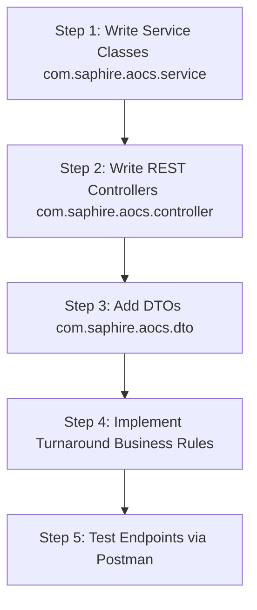

# Anay Technical Requirements & Handoff Guide for Understanding the Project

**Project:** Saphire Airport Operations Coordination System (AOCS)  
**Target Audience:** Anay Modi (Backend API & Logic Lead)  
**Author:** Krishna Solanki (Database & System Integration Lead)  
**Document Version:** 1.0  
**Date:** 2026-07-28  

---

## 1. Executive Summary: What Has Been Done for You

Welcome Anay! To make your job building backend REST Controllers and Business Logic as smooth and fast as possible, **all database setup, ORM object mappings, and data access repositories have been 100% built, configured, and verified for you**.

### What you DO NOT need to worry about:
* ❌ You **do not** need to write SQL queries or design database tables.
* ❌ You **do not** need to configure JDBC drivers, database connections, or Flyway migrations.
* ❌ You **do not** need to write Java `@Entity` objects or manual table mappings.
* ❌ You **do not** need to write boilerplate database CRUD code.

### What has been handed to you on a silver platter:
* ✅ **38 Normalized PostgreSQL Tables** automatically created in your local database via Flyway (`V1__initial_schema.sql`).
* ✅ **7,000+ Real-World Seed Data Rows** automatically populated via Flyway (`V2__seed_data.sql`).
* ✅ **17 Java `@Entity` Objects** mapping every single database table into standard Java objects (`Flight.java`, `TurnaroundTask.java`, `Gate.java`, `User.java`, etc.).
* ✅ **16 Spring Data Repositories** allowing you to query, insert, update, and delete database records using **1-line Java method calls**.
* ✅ **Pre-Configured Maven (`pom.xml`) & Properties (`application.properties`)**: The moment you pull this repository and run `mvn spring-boot:run` (or click Play in IntelliJ), the backend starts up, connects to PostgreSQL, runs Flyway migrations, and is ready for your controllers!

---

## 2. Project Vision & Domain Context (Dumbed Down)

### What is AOCS?
**AOCS** is an internal coordination platform for ground staff at an airport. Imagine an airplane landing on the runway: before that airplane can take off again with new passengers, a dozen teams must service it within 45 to 60 minutes:
1. **Ramp Team** guides the plane to a parking stand (`Gate` / `Stand`).
2. **Cabin Cleaning Crew** cleans the seats and vacuums the cabin.
3. **Refueling Team** pumps fuel into the wings.
4. **Maintenance Engineers** inspect engines and avionics.
5. **Catering Crew** replaces food and beverage carts.
6. **Security Team** conducts a cabin security sweep.
7. **Gate Agents** board the new passengers.

If any of these teams are delayed by 5 minutes, the airplane misses its takeoff slot, costing thousands of dollars and frustrating passengers. **AOCS digitizes this process on one live dashboard so ground supervisors can track every task in real-time.**

> ⚠️ **Key Scope Reminder**: This software is **NOT** a passenger ticket booking system (like MakeMyTrip or Expedia). It is strictly an **internal operational coordination tool** used by airport staff.

---

## 3. The Saphire Hub Rule (Crucial Architecture Constraint)

Our project's home airport is **Saphire International Airport** (Spelled with a single **'P'** for aesthetic branding):

* **Airport Name**: Saphire International Airport
* **IATA 3-Letter Code**: **`SPH`**
* **ICAO 4-Letter Code**: **`VASP`**
* **Location**: Saphire City, India (`Asia/Kolkata` timezone)
* **Primary Database ID**: `airport_id = 1`

### ✈️ The Saphire Routing Constraint:
Because our software runs inside Saphire Airport's control tower, **we only care about flights that touch Saphire Airport (`SPH`)**. 

A flight traveling from Mumbai (`BOM`) to Delhi (`DEL`) never lands at Saphire Airport, so Saphire's ground crew doesn't service it. Therefore, every flight record in our database strictly follows this rule:

$$\text{Origin} = \text{SPH (Outbound Departure)} \quad \text{OR} \quad \text{Destination} = \text{SPH (Inbound Arrival)}$$

```mermaid
graph TD
    subgraph Tracked by Saphire AOCS
        A[External Airport e.g. BOM, DEL, DXB, LHR] -->|Inbound Arrival| SPH[Saphire International Airport - SPH]
        SPH -->|Outbound Departure| B[External Airport e.g. BOM, DEL, DXB, JFK]
    }
    
    subgraph Excluded from Saphire AOCS
        C[Mumbai - BOM] -.-|Ignored Third-Party Route| D[Delhi - DEL]
    }
```

* **Database Enforcement**: `V1__initial_schema.sql` has a DB-level constraint `CONSTRAINT chk_saphire_hub CHECK (origin_airport_id = 1 OR destination_airport_id = 1)`.
* **Repository Enforcement**: `FlightRepository.java` provides `findAllSaphireHubFlights()` which automatically filters for `SPH` flights.

---

## 4. The Java Object Model (All 17 `@Entity` Classes Explained)

In Java Spring Boot, you don't write SQL `SELECT` or `INSERT` statements. Instead, Krishna built **17 Java Entity Classes** in `com.saphire.aocs.entity`. Each class represents a database table:

### 1. `Flight.java` (The Central Entity)
* **What it represents**: A specific scheduled flight leg arriving at or departing from Saphire Airport.
* **Key Fields**: `flightId`, `flightNumber` (e.g. "AI-101"), `flightStatus` ("SCHEDULED", "LANDED", "ON_BLOCK", "SERVICING", "READY", "BOARDING", "AIRBORNE", "DEPARTED", "DELAYED"), `flightType` ("ARRIVAL" / "DEPARTURE"), `scheduledDepartureTime`, `scheduledArrivalTime`, `actualDepartureTime`, `actualArrivalTime`.
* **Relationships**: Links to `@ManyToOne` `originAirport`, `destinationAirport`, `airline`, `aircraft`, `gate`, `stand`.

### 2. `TurnaroundTask.java` (The Turnaround Work Unit)
* **What it represents**: A specific service task assigned to a department for a flight.
* **Key Fields**: `taskId`, `taskName` ("CLEANING", "REFUELING", "LINE_MAINTENANCE", "CATERING", "BOARDING", "SECURITY"), `priority` ("NORMAL", "HIGH", "CRITICAL"), `status` ("PENDING", "IN_PROGRESS", "COMPLETED", "DELAYED", "TECHNICAL_ISSUE", "READY_FOR_PUSHBACK"), `plannedStart`, `plannedEnd`, `actualStart`, `actualEnd`, `notes`.
* **Relationships**: `@ManyToOne` link to `flight`, `department`, `assignedUser`.

### 3. `Airport.java`
* **What it represents**: Master registry of global airports.
* **Key Fields**: `airportId`, `iataCode` ("SPH", "BOM", "DEL", "DXB"), `icaoCode`, `airportName`, `city`, `country`, `timezone`.

### 4. `Airline.java`
* **What it represents**: Operating air carriers.
* **Key Fields**: `airlineId`, `iataCode` ("AI", "6E", "UK"), `icaoCode`, `airlineName` ("Air India", "IndiGo"), `country`.

### 5. `AircraftType.java`
* **What it represents**: Aircraft category physical specifications.
* **Key Fields**: `typeId`, `typecode` ("A320", "B737", "B777"), `manufacturer`, `modelName`, `wingspanMeters`, `mtowKg`, `maxPassengerCapacity`.

### 6. `Aircraft.java`
* **What it represents**: Physical airplanes in an airline's fleet.
* **Key Fields**: `aircraftId`, `registrationNumber` (Tail number e.g. "VT-ANP"), `typeId`, `airlineId`.

### 7. `Gate.java`
* **What it represents**: Passenger boarding gates.
* **Key Fields**: `gateId`, `gateNumber` ("A1", "A2", "B4").

### 8. `Stand.java`
* **What it represents**: Aircraft parking stands on the tarmac.
* **Key Fields**: `standId`, `standNumber` ("Stand-12"), `isRemote` (boolean), `hasJetbridge` (boolean), `assignedGateId`.

### 9. `User.java`
* **What it represents**: Airport staff member accounts.
* **Key Fields**: `userId`, `username`, `name`, `roleId`, `departmentId`.

### 10. `Role.java`
* **What it represents**: Stakeholder permission groups.
* **Key Fields**: `roleId`, `roleName` ("AIRPORT_OPERATIONS_MANAGER", "GROUND_HANDLING_SUPERVISOR", "RAMP_AGENT", "GATE_AGENT", etc.).

### 11. `Department.java`
* **What it represents**: Operational departments.
* **Key Fields**: `departmentId`, `departmentName` ("FLIGHT_OPERATIONS", "RAMP_SERVICES", "CABIN_CLEANING", "REFUELS", "MAINTENANCE", "SECURITY").

### 12. `FuelRequest.java`
* **What it represents**: Refueling activity and fuel load record.
* **Key Fields**: `requestId`, `flightId`, `targetWeightKg`, `actualWeightKg`, `variancePercentage`, `safetyPinVerified`, `status`.
* **Built-in Guardrail**: Has an automatic `@PrePersist` check that calculates variance percentage. If actual fuel weight deviates by more than $\pm 1.0\%$ from target weight, it throws an `IllegalArgumentException` and aborts the transaction (NFR §3.11 compliance).

### 13. `PassengerManifest.java`
* **What it represents**: Traveler manifest for boarding and security.
* **Key Fields**: `passengerId`, `flightId`, `passengerName`, `passportNumber`, `seatNumber`, `isBoarded`.
* **Built-in Helper**: Has a helper method `getMaskedPassportNumber()` returning `XXXX-XXXX-1234` for non-immigration displays (NFR §3.15 compliance).

### 14. `DelayLog.java` & 15. `DelayLogId.java`
* **What it represents**: Delay incidents logged against flights/tasks.
* **Key Fields**: Composite key (`flightId`, `delaySequence`), `reasonCategory`, `delayMinutes`, `explanation`, `loggedByUserId`.

### 16. `AuditLog.java`
* **What it represents**: Security action history log.
* **Key Fields**: `logId`, `userId`, `action` ("LOGIN", "GATE_CHANGE", "TASK_UPDATE"), `targetEntity`, `targetId`, `timestamp`, `ipAddress`.

### 17. `Notification.java`
* **What it represents**: Real-time staff notifications.
* **Key Fields**: `notificationId`, `recipientUserId`, `title`, `message`, `notificationType`, `isRead`, `createdAt`.

---

## 5. The Data Access Layer (All 16 Repositories Explained with 1-Line Java Examples)

To fetch or save data in Spring Boot, **you just inject the repository** and call its built-in methods:

```java
@Autowired
private FlightRepository flightRepository;

@Autowired
private TaskRepository taskRepository;

@Autowired
private FuelRequestRepository fuelRequestRepository;
```

### Quick Reference of All 16 Repositories:

| Repository Name | What You Can Query With It | Example 1-Line Java Call |
| :--- | :--- | :--- |
| **`FlightRepository`** | Fetch SPH hub flights, filter by status or flight number. | `flightRepository.findAllSaphireHubFlightsWithDetails()` |
| **`TaskRepository`** | Find tasks by flight ID, department ID, or status. | `taskRepository.findByFlight_FlightId(flightId)` |
| **`FuelRequestRepository`** | Find fuel requests for a flight or status. | `fuelRequestRepository.findByFlight_FlightId(flightId)` |
| **`PassengerManifestRepository`** | Get passenger manifests for a flight. | `passengerManifestRepository.findByFlight_FlightId(flightId)` |
| **`GateRepository`** | Fetch all airport gates. | `gateRepository.findAll()` |
| **`StandRepository`** | Fetch all tarmac stands. | `standRepository.findAll()` |
| **`UserRepository`** | Find user by username or ID. | `userRepository.findByUsername("admin")` |
| **`DepartmentRepository`** | Find department details. | `departmentRepository.findById(departmentId)` |
| **`RoleRepository`** | Find role details. | `roleRepository.findAll()` |
| **`AircraftRepository`** | Find aircraft by tail registration number. | `aircraftRepository.findByRegistrationNumber("VT-ANP")` |
| **`AircraftTypeRepository`** | Find aircraft model specs by typecode. | `aircraftTypeRepository.findByTypecode("A320")` |
| **`AirlineRepository`** | Find airline details by IATA code. | `airlineRepository.findByIataCode("AI")` |
| **`AirportRepository`** | Find airport details by IATA code. | `airportRepository.findByIataCode("SPH")` |
| **`NotificationRepository`** | Fetch unread notifications for a user. | `notificationRepository.findByRecipientUserIdAndIsReadFalse(userId)` |
| **`DelayLogRepository`** | Fetch delay records for a flight. | `delayLogRepository.findByFlight_FlightId(flightId)` |
| **`AuditLogRepository`** | Fetch recent audit history logs. | `auditLogRepository.findAll()` |

---

## 6. Anay's Step-by-Step Roadmap: What You Need to Build Next

Now that the database and repositories are complete, here is your step-by-step roadmap to build the REST APIs and Business Logic:



### 📍 Step 1: Create Service Classes (`com.saphire.aocs.service`)
Create Service classes annotated with `@Service` to hold your business logic:
1. `FlightService.java`: Business methods for creating flights, updating flight status, and retrieving daily schedules.
2. `TurnaroundTaskService.java`: Business methods for creating turnaround tasks, assigning staff, and marking tasks `COMPLETED`.
3. `GateService.java`: Business methods for assigning and changing gates.
4. `AuthService.java`: User login and authentication logic.

### 📍 Step 2: Create REST Controllers (`com.saphire.aocs.controller`)
Create REST Controller classes annotated with `@RestController` and `@RequestMapping` to expose HTTP endpoints for Anuvrat's React UI:
1. `FlightController.java`:
   * `GET /api/flights` $\rightarrow$ Returns list of SPH flights.
   * `GET /api/flights/{id}` $\rightarrow$ Returns single flight details.
   * `POST /api/flights` $\rightarrow$ Creates new flight.
   * `PUT /api/flights/{id}/status` $\rightarrow$ Updates flight status.
2. `TaskController.java`:
   * `GET /api/tasks/flight/{flightId}` $\rightarrow$ Returns tasks for a flight.
   * `PUT /api/tasks/{taskId}/status` $\rightarrow$ Updates task status (`IN_PROGRESS`, `COMPLETED`).
3. `GateController.java`:
   * `GET /api/gates` $\rightarrow$ Returns list of gates.
   * `PUT /api/flights/{flightId}/assign-gate` $\rightarrow$ Assigns gate to flight.
4. `AuthController.java`:
   * `POST /api/auth/login` $\rightarrow$ Authenticates user credentials.

### 📍 Step 3: Implement Core Business Rules (Turnaround Workflow Engine)
Write the business logic in your service methods:
* **Rule 1 (Boarding Lockout)**: In `FlightService.updateStatus()`, check that cabin cleaning, refueling, and maintenance tasks are all marked `COMPLETED` before allowing a flight's status to transition to `BOARDING`.
* **Rule 2 (Gate Conflict Check)**: In `GateService.assignGate()`, check that the gate is not currently assigned to another active flight during the same time window.
* **Rule 3 (Delay Escalation)**: In `TurnaroundTaskService.updateStatus()`, if actual task end time exceeds planned end time, automatically create an entry in `DelayLog` and trigger a `Notification`.

---

## 7. How to Test Your Backend Code

1. Navigate to the `backend/` folder in your terminal:
   ```bash
   cd backend
   ```
2. Start the Spring Boot server:
   ```bash
   mvn spring-boot:run
   ```
3. Open Postman or your browser and visit:
   `http://localhost:8080/api/flights`
4. You will see a clean JSON response containing Saphire International Airport flights fetched directly from PostgreSQL!

---

### Summary Handoff Table

| Layer | Built By | Location | Description |
| :--- | :--- | :--- | :--- |
| **Database & SQL** | Krishna | `db/migration/` | PostgreSQL 38 tables & Flyway seed data (`V1`, `V2`). |
| **Java Entities** | Krishna | `com.saphire.aocs.entity` | 17 Object models mapping database tables. |
| **Java Repositories** | Krishna | `com.saphire.aocs.repository` | 16 Data access interfaces with JPQL queries. |
| **Services & Business Logic** | **Anay (Next Step)** | `com.saphire.aocs.service` | Business rules, turnaround state engine, validations. |
| **REST Controllers** | **Anay (Next Step)** | `com.saphire.aocs.controller` | HTTP endpoints (`/api/flights`, `/api/tasks`, etc.). |
| **React UI Screens** | Anuvrat | `frontend/` | 15+ Web pages & Material UI dashboard grid. |
| **SRS, UML & QA** | Chaitanya | `documentation/DOCS/` | SRS document, Use Case diagrams, Postman tests. |
