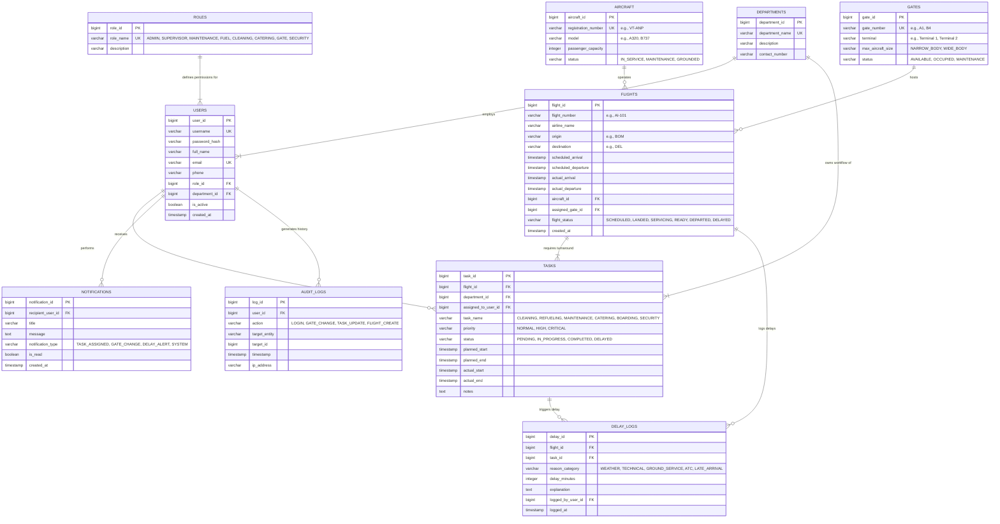

# Entity-Relationship (ER) Diagram Specification
**Project:** Airport Operations Coordination System (AOCS)  
**Document Version:** 1.0  
**Date:** 2026-07-23  

---

## 1. Visual ER Diagram (Mermaid)

---

## 2. Detailed Attribute & Constraint Breakdown

### 2.1 `ROLES`
| Attribute | Data Type | Constraints | Description |
| :--- | :--- | :--- | :--- |
| `role_id` | `BIGINT` | PRIMARY KEY, AUTO_INCREMENT | Unique identifier for role. |
| `role_name` | `VARCHAR(50)` | UNIQUE, NOT NULL | Role title (ADMIN, SUPERVISOR, MAINTENANCE, FUEL, CLEANING, CATERING, GATE, SECURITY). |
| `description` | `VARCHAR(255)` | NULLABLE | Brief explanation of role permissions. |

---

### 2.2 `DEPARTMENTS`
| Attribute | Data Type | Constraints | Description |
| :--- | :--- | :--- | :--- |
| `department_id` | `BIGINT` | PRIMARY KEY, AUTO_INCREMENT | Unique identifier for department. |
| `department_name` | `VARCHAR(100)` | UNIQUE, NOT NULL | Department name (e.g., Refueling Dept, Cabin Cleaning). |
| `description` | `VARCHAR(255)` | NULLABLE | Scope of operations. |
| `contact_number` | `VARCHAR(20)` | NULLABLE | Department hotline / internal extension. |

---

### 2.3 `USERS`
| Attribute | Data Type | Constraints | Description |
| :--- | :--- | :--- | :--- |
| `user_id` | `BIGINT` | PRIMARY KEY, AUTO_INCREMENT | Unique staff member ID. |
| `username` | `VARCHAR(50)` | UNIQUE, NOT NULL | Login username. |
| `password_hash` | `VARCHAR(255)` | NOT NULL | Encrypted password (BCrypt). |
| `full_name` | `VARCHAR(100)` | NOT NULL | Staff member's full name. |
| `email` | `VARCHAR(100)` | UNIQUE, NOT NULL | Work email address. |
| `phone` | `VARCHAR(20)` | NULLABLE | Mobile phone number. |
| `role_id` | `BIGINT` | FOREIGN KEY (`ROLES.role_id`), NOT NULL | Assigned role permission level. |
| `department_id` | `BIGINT` | FOREIGN KEY (`DEPARTMENTS.department_id`), NULLABLE | Belonging department. |
| `is_active` | `BOOLEAN` | DEFAULT TRUE | Account status flag. |
| `created_at` | `TIMESTAMP` | DEFAULT CURRENT_TIMESTAMP | Registration timestamp. |

---

### 2.4 `AIRCRAFT`
| Attribute | Data Type | Constraints | Description |
| :--- | :--- | :--- | :--- |
| `aircraft_id` | `BIGINT` | PRIMARY KEY, AUTO_INCREMENT | Unique aircraft ID. |
| `registration_number` | `VARCHAR(20)` | UNIQUE, NOT NULL | Tail number (e.g., VT-ANP, VT-EXA). |
| `model` | `VARCHAR(50)` | NOT NULL | Plane model (e.g., Airbus A320neo, Boeing 737 MAX). |
| `passenger_capacity` | `INTEGER` | NOT NULL | Max seating capacity. |
| `status` | `VARCHAR(30)` | NOT NULL | Current status (IN_SERVICE, MAINTENANCE, GROUNDED). |

---

### 2.5 `GATES`
| Attribute | Data Type | Constraints | Description |
| :--- | :--- | :--- | :--- |
| `gate_id` | `BIGINT` | PRIMARY KEY, AUTO_INCREMENT | Unique gate ID. |
| `gate_number` | `VARCHAR(10)` | UNIQUE, NOT NULL | Gate code (e.g., A1, A2, B5). |
| `terminal` | `VARCHAR(20)` | NOT NULL | Terminal name (e.g., Terminal 1, Terminal 2). |
| `max_aircraft_size` | `VARCHAR(20)` | NOT NULL | Size compatibility (NARROW_BODY, WIDE_BODY). |
| `status` | `VARCHAR(30)` | NOT NULL | Operational status (AVAILABLE, OCCUPIED, MAINTENANCE). |

---

### 2.6 `FLIGHTS`
| Attribute | Data Type | Constraints | Description |
| :--- | :--- | :--- | :--- |
| `flight_id` | `BIGINT` | PRIMARY KEY, AUTO_INCREMENT | Unique flight operational ID. |
| `flight_number` | `VARCHAR(20)` | NOT NULL | Flight code (e.g., AI-101, 6E-204). |
| `airline_name` | `VARCHAR(100)` | NOT NULL | Operating airline (Air India, IndiGo). |
| `origin` | `VARCHAR(10)` | NOT NULL | Origin airport IATA code (e.g., BOM). |
| `destination` | `VARCHAR(10)` | NOT NULL | Destination airport IATA code (e.g., DEL). |
| `scheduled_arrival` | `TIMESTAMP` | NOT NULL | STA (Scheduled Time of Arrival). |
| `scheduled_departure` | `TIMESTAMP` | NOT NULL | STD (Scheduled Time of Departure). |
| `actual_arrival` | `TIMESTAMP` | NULLABLE | ATA (Actual Time of Arrival). |
| `actual_departure` | `TIMESTAMP` | NULLABLE | ATD (Actual Time of Departure). |
| `aircraft_id` | `BIGINT` | FOREIGN KEY (`AIRCRAFT.aircraft_id`), NOT NULL | Operating plane. |
| `assigned_gate_id` | `BIGINT` | FOREIGN KEY (`GATES.gate_id`), NULLABLE | Assigned parking gate. |
| `flight_status` | `VARCHAR(30)` | NOT NULL | Turnaround stage (SCHEDULED, LANDED, SERVICING, READY, DEPARTED, DELAYED). |
| `created_at` | `TIMESTAMP` | DEFAULT CURRENT_TIMESTAMP | Record creation timestamp. |

---

### 2.7 `TASKS`
| Attribute | Data Type | Constraints | Description |
| :--- | :--- | :--- | :--- |
| `task_id` | `BIGINT` | PRIMARY KEY, AUTO_INCREMENT | Unique task ID. |
| `flight_id` | `BIGINT` | FOREIGN KEY (`FLIGHTS.flight_id`), NOT NULL | Related flight turnaround. |
| `department_id` | `BIGINT` | FOREIGN KEY (`DEPARTMENTS.department_id`), NOT NULL | Responsible department. |
| `assigned_to_user_id` | `BIGINT` | FOREIGN KEY (`USERS.user_id`), NULLABLE | Specific assigned staff member. |
| `task_name` | `VARCHAR(100)` | NOT NULL | Activity type (Cleaning, Refueling, Maintenance, Catering, Boarding, Security). |
| `priority` | `VARCHAR(20)` | DEFAULT 'NORMAL' | Severity (NORMAL, HIGH, CRITICAL). |
| `status` | `VARCHAR(30)` | DEFAULT 'PENDING' | Execution state (PENDING, IN_PROGRESS, COMPLETED, DELAYED). |
| `planned_start` | `TIMESTAMP` | NOT NULL | Planned start time. |
| `planned_end` | `TIMESTAMP` | NOT NULL | Target completion deadline. |
| `actual_start` | `TIMESTAMP` | NULLABLE | Actual timestamp when task marked IN_PROGRESS. |
| `actual_end` | `TIMESTAMP` | NULLABLE | Actual timestamp when task marked COMPLETED. |
| `notes` | `TEXT` | NULLABLE | Shift notes or progress comments. |

---

### 2.8 `DELAY_LOGS`
| Attribute | Data Type | Constraints | Description |
| :--- | :--- | :--- | :--- |
| `delay_id` | `BIGINT` | PRIMARY KEY, AUTO_INCREMENT | Unique delay record ID. |
| `flight_id` | `BIGINT` | FOREIGN KEY (`FLIGHTS.flight_id`), NOT NULL | Affected flight. |
| `task_id` | `BIGINT` | FOREIGN KEY (`TASKS.task_id`), NULLABLE | Causing task (if applicable). |
| `reason_category` | `VARCHAR(50)` | NOT NULL | Primary category (WEATHER, TECHNICAL, GROUND_SERVICE, ATC, LATE_ARRIVAL). |
| `delay_minutes` | `INTEGER` | NOT NULL | Total delay duration in minutes. |
| `explanation` | `TEXT` | NOT NULL | Supervisor delay breakdown statement. |
| `logged_by_user_id` | `BIGINT` | FOREIGN KEY (`USERS.user_id`), NOT NULL | Staff member who logged the delay. |
| `logged_at` | `TIMESTAMP` | DEFAULT CURRENT_TIMESTAMP | Logging timestamp. |

---

### 2.9 `NOTIFICATIONS`
| Attribute | Data Type | Constraints | Description |
| :--- | :--- | :--- | :--- |
| `notification_id` | `BIGINT` | PRIMARY KEY, AUTO_INCREMENT | Unique notification ID. |
| `recipient_user_id` | `BIGINT` | FOREIGN KEY (`USERS.user_id`), NOT NULL | Alert recipient. |
| `title` | `VARCHAR(100)` | NOT NULL | Alert header. |
| `message` | `TEXT` | NOT NULL | Full alert body content. |
| `notification_type` | `VARCHAR(50)` | NOT NULL | Alert classification (TASK_ASSIGNED, GATE_CHANGE, DELAY_ALERT, SYSTEM). |
| `is_read` | `BOOLEAN` | DEFAULT FALSE | Read/Unread flag. |
| `created_at` | `TIMESTAMP` | DEFAULT CURRENT_TIMESTAMP | Generation timestamp. |

---

### 2.10 `AUDIT_LOGS`
| Attribute | Data Type | Constraints | Description |
| :--- | :--- | :--- | :--- |
| `log_id` | `BIGINT` | PRIMARY KEY, AUTO_INCREMENT | Unique audit log entry. |
| `user_id` | `BIGINT` | FOREIGN KEY (`USERS.user_id`), NULLABLE | Performing user ID. |
| `action` | `VARCHAR(100)` | NOT NULL | Action type (LOGIN, GATE_CHANGE, TASK_UPDATE, FLIGHT_CREATE). |
| `target_entity` | `VARCHAR(50)` | NOT NULL | Affected table (e.g., FLIGHTS, TASKS). |
| `target_id` | `BIGINT` | NULLABLE | ID of affected entity. |
| `timestamp` | `TIMESTAMP` | DEFAULT CURRENT_TIMESTAMP | Execution timestamp. |
| `ip_address` | `VARCHAR(45)` | NULLABLE | Origin IP address. |

---

## 3. Key Relationships & Cardinalities Summary

1. **`ROLES` (1) to `USERS` (N)**: One role belongs to many users; each user has exactly one role.
2. **`DEPARTMENTS` (1) to `USERS` (N)**: One department employs many staff members.
3. **`DEPARTMENTS` (1) to `TASKS` (N)**: One department is assigned responsibility for many tasks.
4. **`USERS` (1) to `TASKS` (N)**: One staff member can be assigned multiple turnaround tasks over time.
5. **`AIRCRAFT` (1) to `FLIGHTS` (N)**: One aircraft operates multiple flight legs.
6. **`GATES` (1) to `FLIGHTS` (N)**: One gate hosts multiple arriving/departing flights sequentially.
7. **`FLIGHTS` (1) to `TASKS` (N)**: One flight turnaround requires multiple department tasks (Cleaning, Fuel, Catering, etc.).
8. **`FLIGHTS` (1) to `DELAY_LOGS` (N)**: A flight can experience multiple delay incidents.
9. **`USERS` (1) to `NOTIFICATIONS` (N)**: A user receives multiple system notifications.
10. **`USERS` (1) to `AUDIT_LOGS` (N)**: User actions generate audit history records.
