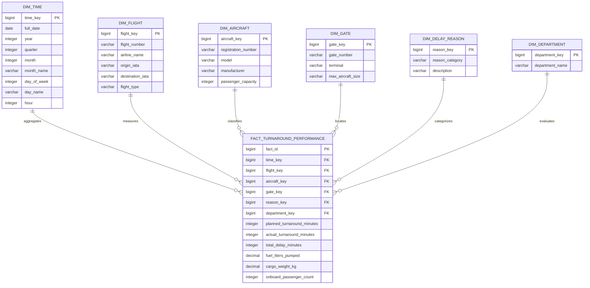

# Analytics Star Schema Architecture

**System:** Saphire Airport Operations Coordination System (AOCS) (AOCS) Data Warehouse  
**Model Type:** Star Schema (1 Central Fact Table + 6 Dimension Tables)  

---

## 1. Dimensional Architecture Diagram

---

## 2. Fact & Dimension Table Definitions

### 2.1 Central Fact Table: `FACT_TURNAROUND_PERFORMANCE`
* **Grain:** One row per completed aircraft turnaround flight leg.
* **Foreign Keys:** `time_key`, `flight_key`, `aircraft_key`, `gate_key`, `reason_key`, `department_key`.
* **Additive Measures:**
  * `planned_turnaround_minutes`: Baseline scheduled turnaround window.
  * `actual_turnaround_minutes`: Realized ground time from On-Block to Pushback.
  * `total_delay_minutes`: Cumulative delay across all tasks.
  * `fuel_liters_pumped`: Volume of fuel loaded.
  * `cargo_weight_kg`: Weight of commercial cargo loaded.
  * `onboard_passenger_count`: Total boarded passengers.

---

## 3. Why Star Schema Over Snowflake Schema?

1. **Query Performance**: Star schema denormalizes dimensions, eliminating multi-level joins when aggregating large analytical queries for executive dashboards.
2. **Simplicity for BI Tools**: Directly integrates into visualization platforms (PowerBI, Tableau, Superset) without complex join paths.
