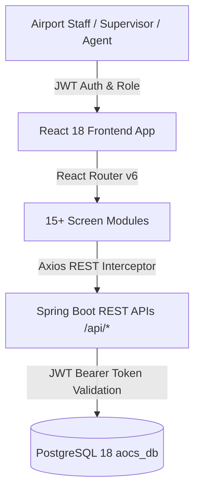

# Phase 3 Master Frontend Specification & Functional Requirements Document

**Project:** Saphire Airport Operations Coordination System (AOCS)  
**Target Tech Stack:** React 18 + TypeScript + Vite + Material UI (MUI v5) + Axios + React Router v6  
**Operational Inspiration:** Chhatrapati Shivaji Maharaj International Airport (CSMIA Mumbai Hub — `csmia-mumbai.adaniairports.com`)  
**UI/UX Inspiration References:** Refero Design (`styles.refero.design`), MotionSites (`motionsites.ai`), Mobbin (`mobbin.com`), Aceternity UI (`ui.aceternity.com`)  
**Document Version:** 1.0  
**Date:** 2026-07-30  

---

## 1. Executive Context & Functional Vision

The Saphire AOCS Frontend serves as the command-and-control interface for ground staff, airport operations managers, ramp supervisors, gate agents, and security personnel at **Saphire International Airport Hub (`SPH` / `VASP`)**.

Inspired by real-time international hub operations (such as Mumbai CSMIA), the system unifies flight turnaround tracking, gate allocation maps, fuel load safety verification, baggage manifest tracking, and security sweep approvals into a single, high-reliability web application.



---

## 2. System User Roles & Access Control Boundaries

The frontend strictly enforces Role-Based Access Control (RBAC) via route guards and component-level permission checks across 10 operational roles:

| Role ID | Role Code | Department | Primary Operational Boundary & Key Responsibilities |
| :---: | :--- | :--- | :--- |
| **1** | `AIRPORT_OPERATIONS_MANAGER` | `FLIGHT_OPERATIONS` | Full system command, overall turnaround monitoring, executive metrics, master delay overrides. |
| **2** | `GROUND_HANDLING_SUPERVISOR` | `GROUND_HANDLING` | Direct turnaround task assignment, delay reason logging, task sign-off. |
| **3** | `RAMP_AGENT` | `GROUND_HANDLING` | Ramp task execution (fueling, catering, cleaning), mobile milestone updates. |
| **4** | `BAGGAGE_HANDLER` | `BAGGAGE_SERVICES` | Baggage carousel assignments, bag tag scanning events, mishandled baggage logs. |
| **5** | `GATE_AGENT` | `PASSENGER_SERVICES` | Gate allocation, passenger boarding counters, manifest verification. |
| **6** | `CHECKIN_AGENT` | `PASSENGER_SERVICES` | Counter allocation, passenger PNR lookups, boarding pass issuance. |
| **7** | `SECURITY_OFFICER` | `SECURITY_AND_SAFETY` | Terminal security sweeps, ramp security clearance, checkpoint logs. |
| **8** | `IMMIGRATION_OFFICER` | `IMMIGRATION_BORDER_CONTROL` | Passport chip scanning, biometric facial matching, immigration records. |
| **9** | `AIRLINE_BILLING_CLERK` | `AIRLINE_FINANCE_BILLING` | Invoice generation, line item billing, airline statement exports. |
| **10** | `SYSTEM_ADMINISTRATOR` | `IT_AND_SYSTEMS` | System audit log inspection, user management, configuration. |

---

## 3. Screen-by-Screen Functional Specifications (15+ Web Modules)

### 3.1 `LoginPage.tsx` (Staff Authentication & Role Selection)
* **Primary Objective**: Secure staff entry point with JWT token issuance and role-based initial dashboard routing.
* **Core Functions**:
  - Username & Password inputs with validation.
  - Role dropdown selector (pre-selects or auto-detects assigned department).
  - Submits to `POST /api/auth/login`.
  - Persists JWT `token` in `localStorage` / `sessionStorage`.
  - Displays RFC 7807 error toasts (e.g. "Invalid username or password").

---

### 3.2 `DashboardPage.tsx` (Real-Time Operations Command Grid)
* **Primary Objective**: Master airport operational dashboard inspired by CSMIA Mumbai's central control unit.
* **Core Functions**:
  - High-level metric cards: Active Hub Flights, Landed Count, Delayed Count, On-Time Departure Rate (%), Pending Tasks.
  - Real-time Flight Status Ticker (Incoming arrivals & imminent departures).
  - Gate & Parking Stand Occupancy Mini-Map.
  - Active Delay Alerts drawer showing critical delays (>15 mins).
  - Calls `GET /api/reports/summary` and `GET /api/flights`.

---

### 3.3 `FlightSchedulePage.tsx` (Live FIDS Flight Schedule Matrix)
* **Primary Objective**: Comprehensive Flight Information Display System (FIDS) table for all SPH hub flights.
* **Core Functions**:
  - Flight list table displaying Flight #, Airline, Aircraft Registration, Origin/Destination, Scheduled/Estimated Times, Gate, Stand, and Status Chip.
  - Filter controls: All Flights, Inbound (`ARRIVAL`), Outbound (`DEPARTURE`), Status filter (`SCHEDULED`, `LANDED`, `SERVICING`, `BOARDING`, `DELAYED`).
  - Search bar supporting flight number or airline name lookup.
  - Action button: "View Turnaround Detail" (`/flights/{id}`) and "Update Status" modal.

---

### 3.4 `FlightDetailPage.tsx` (Turnaround Progress & Milestone Tracker)
* **Primary Objective**: Deep-dive single-flight view tracking turnaround progress from touchdown to pushback.
* **Core Functions**:
  - Top Summary Card: Flight details, assigned gate/stand, aircraft tail number, rotation inbound flight reference.
  - Interactive Turnaround Milestone Progress Bar (`SCHEDULED` ➔ `LANDED` ➔ `ON_BLOCK` ➔ `SERVICING` ➔ `READY` ➔ `BOARDING` ➔ `AIRBORNE` ➔ `DEPARTED`).
  - Sub-task checklist timeline (Cleaning, Refueling, Maintenance, Catering, Boarding, Security).
  - Delay Log timeline listing delay codes, duration in minutes, and sequence numbers.
  - Status Update Modal submitting to `PUT /api/flights/{id}/status`.

---

### 3.5 `GateAllocationPage.tsx` (Interactive Terminal & Stand Map)
* **Primary Objective**: Gate and parking stand allocation controller for ground planners.
* **Core Functions**:
  - Terminal grid view (Terminal 1, Terminal 2, Remote Stands).
  - Gate cards showing current occupying flight, ground occupancy window (`[start, end]`), jetbridge status, and remote stand indicators.
  - Gate Assignment Modal: Form selecting Flight ID, Gate ID, and optional Stand ID.
  - Automatic Conflict Warning: Intercepts `409 Conflict` responses when an overlapping flight occupies the gate or stand.
  - Calls `GET /api/gates` and `PUT /api/gates/assign`.

---

### 3.6 `TaskTrackerPage.tsx` (Turnaround Task Checklist Grid)
* **Primary Objective**: Central task manager for ground supervisors and ramp agents.
* **Core Functions**:
  - Task list table filtered by flight or assigned staff member.
  - Department filter (Ground Handling, Refueling, Cleaning, Catering, Security).
  - Status update controls: `PENDING` ➔ `IN_PROGRESS` ➔ `COMPLETED`.
  - User Assignment dropdown: Assign specific staff member to a task (`PUT /api/tasks/{taskId}/assign`).
  - Ground Crew Notes input box: Captures delay causes and operational remarks (`notes` field).

---

### 3.7 `CabinCleaningModule.tsx` (Cabin Cleaning & Hygiene Sign-Off)
* **Primary Objective**: Specialist module for cabin cleaning crews.
* **Core Functions**:
  - Cleaning checklist: Seat pocket sweep, galley sanitation, lavatory check, vacuuming, waste removal.
  - Inspection sign-off button with supervisor signature input.
  - Triggers task status update to `COMPLETED` for task `CLEANING`.

---

### 3.8 `RefuelingModule.tsx` (Fuel Load Verification & Variance Guard)
* **Primary Objective**: Safety-critical fuel loading calculator and variance check module.
* **Core Functions**:
  - Target fuel weight vs Actual fuel weight input form.
  - Density calculator (`fuel_density` check).
  - Automated $\pm 1.0\%$ Variance Check: Flags an alert if actual fuel deviates by more than 1% from flight plan target.
  - Supervisor PIN authorization prompt for out-of-variance approval.

---

### 3.9 `MaintenanceModule.tsx` (Line Maintenance & Avionics Log)
* **Primary Objective**: Aircraft line maintenance and tech log sign-off module.
* **Core Functions**:
  - Pre-flight inspection checklist (Tires, brakes, APU check, avionics scan).
  - Technical defect reporting form (Defect category, severity, action taken).
  - Maintenance release sign-off (Marks aircraft fit for flight).

---

### 3.10 `CateringModule.tsx` (Galley Cart Replenishment Tracker)
* **Primary Objective**: Catering supply and galley cart seal tracker.
* **Core Functions**:
  - Cart load manifest count (First/Business/Economy meal carts).
  - Seal number verification input.
  - Temperature check logger for fresh meals.

---

### 3.11 `BoardingGateModule.tsx` (Passenger Boarding & Manifest Scanner)
* **Primary Objective**: Gate agent boarding milestone controller.
* **Core Functions**:
  - Live Boarding Passenger Counter (Boarded Count / Total Manifest Count).
  - Zone boarding sequence selector (Zone 1, Zone 2, Zone 3).
  - Scanner simulation input for scanning passenger boarding passes.
  - Final boarding gate closure button (Triggers flight status to `READY`).

---

### 3.12 `SecurityClearancePage.tsx` (Ramp & Cabin Security Sweep)
* **Primary Objective**: Security sweep inspection and clearance sign-off module.
* **Core Functions**:
  - Aircraft security sweep checklist (Unattended baggage scan, cargo hold check, cabin search).
  - Security Officer badge ID verification.
  - Official clearance timestamp submission.

---

### 3.13 `PassengerManifestPage.tsx` (Passenger Manifest & Passport Masking)
* **Primary Objective**: Passenger manifest list viewer complying with privacy regulations.
* **Core Functions**:
  - Passenger list table: Name, PNR Code, Seat Number, Cabin Class, Transit Passenger indicator.
  - **Automated Passport Masking**: Enforces NFR confidentiality by masking passport numbers (`XXXX-XXXX-1234`) unless accessed by authorized immigration roles.
  - Search by PNR code or passenger last name.

---

### 3.14 `ReportsAnalyticsPage.tsx` (Turnaround Delay Analytics & PDF Export)
* **Primary Objective**: Operational reporting and delay cause analysis dashboard.
* **Core Functions**:
  - Delay Cause Distribution Pie Chart (Ground handling delays, weather delays, late incoming aircraft).
  - On-Time Performance (OTP) trend bar charts.
  - Export controls: Generate PDF summary report, Export Excel delay log dataset.

---

### 3.15 `AuditLogViewer.tsx` (Immutable Security Audit Trail)
* **Primary Objective**: System audit log viewer for compliance and security reviews.
* **Core Functions**:
  - Audit log table displaying Action, Entity Type, Entity ID, Performed By (User ID), Timestamp, and IP Address.
  - Expandable JSON payload viewer showing exact change payload (`change_payload` JSONB).

---

## 4. Non-Functional Requirements (NFRs) for Frontend Execution

1. **Performance & Latency**:
   - Sub-2-second initial page rendering and sub-500ms data table filter updates.
   - Axios request timeout set to 5000ms with retry fallback.

2. **Ramp Usability (Glove-Friendly Touch Targets)**:
   - Mobile and tablet responsiveness with large button touch targets (minimum 48px height) for ramp agents wearing safety gloves.
   - High contrast status chips (Green `READY`, Yellow `IN_PROGRESS`, Red `DELAYED`).

3. **Session Safety & Error Resilience**:
   - Automatic JWT token expiration handling (redirects to `/login` upon 401 response).
   - Global Toast Notification drawer displaying RFC 7807 problem details gracefully.

---

## 5. File Structure Blueprint for Phase 3 Execution

When building Phase 3 in `frontend/`, the following TypeScript file layout will be instantiated:

```text
frontend/
├── src/
│   ├── api/
│   │   ├── axiosClient.ts          # Axios instance with Bearer token interceptor
│   │   ├── flightApi.ts            # REST calls for /api/flights
│   │   ├── taskApi.ts              # REST calls for /api/tasks
│   │   ├── gateApi.ts              # REST calls for /api/gates
│   │   ├── authApi.ts              # REST calls for /api/auth
│   │   └── reportApi.ts            # REST calls for /api/reports
│   ├── components/
│   │   ├── Navbar.tsx              # Saphire AOCS header bar with airport time clock
│   │   ├── Sidebar.tsx             # Role-based navigation drawer
│   │   ├── StatusChip.tsx          # Dynamic flight/task status badge
│   │   └── PrivateRoute.tsx        # JWT Auth & Role Guard wrapper
│   ├── context/
│   │   └── AuthContext.tsx         # User session, JWT storage, role state
│   ├── pages/
│   │   ├── LoginPage.tsx
│   │   ├── DashboardPage.tsx
│   │   ├── FlightSchedulePage.tsx
│   │   ├── FlightDetailPage.tsx
│   │   ├── GateAllocationPage.tsx
│   │   ├── TaskTrackerPage.tsx
│   │   ├── CabinCleaningModule.tsx
│   │   ├── RefuelingModule.tsx
│   │   ├── MaintenanceModule.tsx
│   │   ├── CateringModule.tsx
│   │   ├── BoardingGateModule.tsx
│   │   ├── SecurityClearancePage.tsx
│   │   ├── PassengerManifestPage.tsx
│   │   ├── ReportsAnalyticsPage.tsx
│   │   └── AuditLogViewer.tsx
│   ├── App.tsx                     # Main Router & Theme Provider
│   └── main.tsx                    # React DOM entry point
├── package.json
└── vite.config.ts
```
