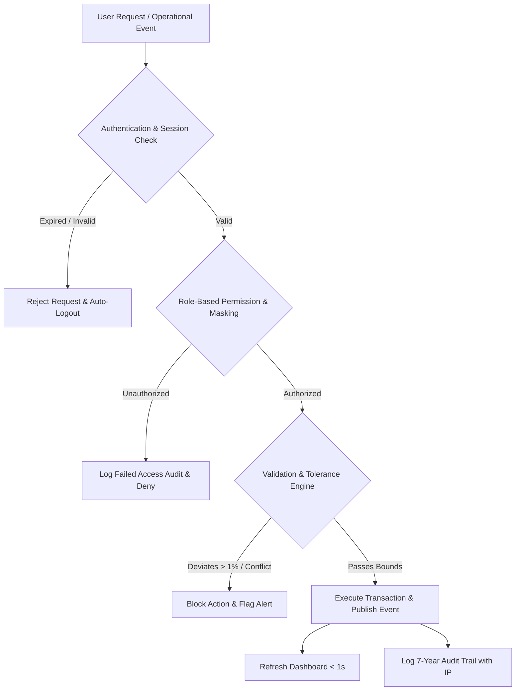

# Non-Functional Requirements (NFRs) & Quality Attributes Specification

**Project:** Saphire Airport Operations Coordination System (AOCS) (AOCS)  
**Document Version:** 1.0  
**Date:** 2026-07-27  
**Academic Reference:** Lab Experiment 2 (Non-Functional Requirements & Agile Quality Attributes)

---

## 1. Architectural Philosophy: Functional vs. Non-Functional

In the Saphire Airport Operations Coordination System (AOCS) (AOCS), **Functional Requirements** define **WHAT** the software does (e.g., assigning a gate, updating fuel status, generating a delay report), whereas **Non-Functional Requirements (NFRs)** define **HOW** the system performs under operational constraints (speed, security, reliability, data integrity, and compliance).

| Aspect | Functional Requirements ('WHAT') | Non-Functional Requirements ('HOW') |
| :--- | :--- | :--- |
| **Focus** | Product Features & Operations | Quality Attributes & System Properties |
| **Elicitation** | Elicited from end-users / business workflow | Defined by Technical Architects & SE Principles |
| **Agile Format** | Feature User Stories | Quality User Stories, Constraints & Definition of Done (DoD) |
| **Validation** | Verified by user acceptance testing | Measured via load tests, latency benchmarks, & security audits |

---

## 2. Backend Engineering Thought Processes & Security Guardrails

Behind every user interaction in AOCS, the backend architecture enforces strict non-functional constraints to ensure flight safety, data integrity, and regulatory compliance.

### Key Backend Rules & Policies:

1. **Confidentiality & Data Masking**:
   * **Rule**: Sensitive traveler data (e.g., passport numbers, visas) must be masked on non-immigration terminals (e.g., `XXXX-XXXX-1234`).
   * **Backend Implementation**: DTO serializer filters sensitive fields based on the caller's role (`CUSTOMS_IMMIGRATION` role receives full string; all other roles receive masked strings).

2. **Safety-Critical Verification & PIN Approvals**:
   * **Rule**: High-risk operational actions (refueling safety clearance, gate override, emergency alert) require secondary authentication (PIN verification).
   * **Backend Implementation**: Secondary endpoint challenge requiring a short-lived PIN hash. Failed attempts are capped at 3 tries before temporary account lockout and security escalation.

3. **Data Integrity & Tolerance Bounds**:
   * **Rule**: Recorded fuel load must be within $\pm 1\%$ of the pilot's requested fuel weight target.
   * **Backend Implementation**: Automated mathematical validation in `RefuelingService`. Rejects invalid inputs before database persistence.

4. **Conflict Prevention & Double-Booking Lockouts**:
   * **Rule**: Stand/Gate allocation engine must mathematically prevent double-booking a parking gate for overlapping time windows.
   * **Backend Implementation**: Pessimistic/Optimistic database locking and SQL range intersection queries (`WHERE gate_id = :id AND time_window OVERLAPS :new_window`).

5. **Inactivity Session Expiration & Rate Limiting**:
   * **Rule**: Unattended ramp or gate terminals auto-logout after inactivity to prevent unauthorized access.
   * **Backend Implementation**: JWT token expiration policies (short-lived access tokens + idle timeout detection).

6. **Immutable Audit Trail**:
   * **Rule**: Every critical transaction (gate change, fuel approval, delay escalation) must log an immutable audit entry retained for 7 years.
   * **Backend Implementation**: `AuditLog` table capturing `user_id`, `action`, `target_entity`, `old_value`, `new_value`, `ip_address`, and `timestamp`.

---

## 3. NFR Quality Attributes Matrix (17 Agile User Stories)

Below are the 17 quality attributes captured as Agile User Stories with explicit, quantifiable Acceptance Criteria (Given... When... Then...):

### 3.1 Performance — AOCC Director
* **User Story**: As an AOCC Director, I want the operations dashboard to update within 1 second of any status change, so that I can react to gate delays, incidents, or landings without lag.
* **Acceptance Criteria**: Given an operational event occurs (flight landing, gate delay, incident), when the event is logged, then the dashboard shall refresh automatically via WebSocket/SSE within **1 second**.

### 3.2 Availability — Airport Administrator
* **User Story**: As an Airport Administrator, I want AOCS to maintain 99.9% uptime, so that staff on every shift can access the system without operational downtime.
* **Acceptance Criteria**: Given the system is live in production, when uptime is measured over a calendar month, then unplanned downtime shall not exceed **43 minutes**.

### 3.3 Security — Fuel Safety Inspector
* **User Story**: As a Fuel Safety Inspector, I want refueling clearance approvals to require a secure PIN, so that only authorized personnel can unlock safety-critical actions.
* **Acceptance Criteria**: Given a clearance approval is submitted, when the entered PIN does not match the registered credential, then the system shall reject the action and log the failed attempt.

### 3.4 Data Retention — Airport Administrator
* **User Story**: As an Airport Administrator, I want audit logs retained for a minimum of 7 years, so that the airport stays compliant with regulatory record-keeping requirements.
* **Acceptance Criteria**: Given an audit log entry is created, when its retention period is checked, then the record shall remain accessible for at least **7 years** before archival or deletion.

### 3.5 Usability — Turnaround Coordinator
* **User Story**: As a Turnaround Coordinator, I want to log a task start in two taps or fewer on the mobile tablet, so that I can update statuses quickly without slowing the turnaround.
* **Acceptance Criteria**: Given the coordinator is on the turnaround checklist screen, when they select an activity, then starting it shall take no more than **2 taps**.

### 3.6 Stability — Gate & Stand Planner
* **User Story**: As a Gate & Stand Planner, I want the stand-map interface to stay responsive when flight schedules change dynamically, so that live reassignments never freeze the planning screen.
* **Acceptance Criteria**: Given several schedule changes occur in quick succession, when the planner is actively working on the stand map, then the interface shall remain fully responsive with zero crashes.

### 3.7 Compliance — Fuel Safety Inspector
* **User Story**: As a Fuel Safety Inspector, I want fuel quality test records to follow IATA fuel-handling standards, so that the airport stays compliant with international aviation safety regulations.
* **Acceptance Criteria**: Given a fuel batch is tested, when results are recorded, then the stored fields shall match IATA-mandated parameters (water content, visual clarity, flashpoint).

### 3.8 Reliability — Gate & Stand Planner
* **User Story**: As a Gate & Stand Planner, I want the allocation engine to never double-book a stand, so that ground safety is never compromised by a scheduling error.
* **Acceptance Criteria**: Given a stand is already reserved for a time window, when a planner attempts a conflicting assignment, then the system shall block the action and flag the conflict.

### 3.9 Recoverability — AOCC Director
* **User Story**: As an AOCC Director, I want the system to restore full operational data within 15 minutes of a server failure, so that airport-wide monitoring is not disrupted for long.
* **Acceptance Criteria**: Given a system outage occurs, when the backup server takes over, then all flight, gate, and task statuses shall be restored to their last known state within **15 minutes**.

### 3.10 Serviceability — Line Maintenance Engineer
* **User Story**: As a Line Maintenance Engineer, I want reported AOCS faults to be diagnosable and serviceable within 2 hours, so that technical issues never leave critical modules down for long.
* **Acceptance Criteria**: Given a system fault is reported, when the support team investigates, then a root cause and a fix or workaround shall be delivered within **2 hours**.

### 3.11 Data Integrity — Aviation Refuelling Operator
* **User Story**: As an Aviation Refuelling Operator, I want the system to validate that recorded fuel weight falls within $\pm 1\%$ of the pilot's target load, so that inaccurate fuel data never reaches the flight record.
* **Acceptance Criteria**: Given a fuel quantity is submitted, when the computed weight deviates by more than 1% from the target load, then the system shall reject the entry and prompt re-verification.

### 3.12 Scalability — Airport Administrator
* **User Story**: As an Airport Administrator, I want the system to scale from 500 to 5,000 active staff accounts without performance loss, so that AOCS can grow alongside airport operations.
* **Acceptance Criteria**: Given the number of active accounts increases, when concurrent sessions exceed 1,000, then average response time shall remain under **2 seconds**.

### 3.13 Capacity — Check-in Counter Agent
* **User Story**: As a Check-in Counter Agent, I want the manifest module to handle up to 20,000 check-ins a day across all counters, so that peak-hour traffic never slows the system down.
* **Acceptance Criteria**: Given check-in volume peaks on a busy travel day, when concurrent transactions reach 20,000/day, then each check-in shall process within **3 seconds**.

### 3.14 Accessibility — Terminal Manager
* **User Story**: As a Terminal Manager, I want all passenger-facing displays and kiosks to comply with accessibility standards, so that travellers with disabilities can navigate the airport independently.
* **Acceptance Criteria**: Given a public-facing screen is deployed, when it is audited, then it shall meet **WCAG 2.1 AA** contrast, font-size, and screen-reader requirements.

### 3.15 Confidentiality — Customs & Immigration Officer
* **User Story**: As a Customs & Immigration Officer, I want passenger passport data masked on shared dashboards, so that sensitive traveller information is never exposed to unauthorized staff.
* **Acceptance Criteria**: Given passenger data is displayed on a non-immigration terminal, when the record renders, then the passport number shall show only the last **4 characters**.

### 3.16 Efficiency — Boarding Gate Agent
* **User Story**: As a Boarding Gate Agent, I want boarding-status updates to process in under 2 seconds, so that gate operations keep pace with real passenger flow.
* **Acceptance Criteria**: Given the agent taps a boarding milestone button, when the request is submitted, then the confirmation and dashboard update shall complete within **2 seconds**.

### 3.17 Portability — Ground Operations Supervisor
* **User Story**: As a Ground Operations Supervisor, I want the mobile task-assignment app to run on both Android and iOS, so that ground staff can use whichever device the airport issues them.
* **Acceptance Criteria**: Given a ground staff device is either Android or iOS, when the AOCS app is installed, then every core feature shall function identically on both platforms.

---

## 4. System-Wide Constraints

The following constraints apply system-wide across all user stories and features:

1. **Dashboard Refresh Constraint**: Operations dashboard must reflect any status change within **1 second** of the event being logged.
2. **PIN Protection Constraint**: Refueling clearance and safety-critical overrides must be auto-rejected and logged whenever the submitted PIN does not match.
3. **Fuel Integrity Constraint**: Recorded fuel weight must be auto-rejected whenever it deviates by more than **$\pm 1\%$** from the target load.
4. **Passport Masking Constraint**: Passport numbers must never render in full on terminals outside Customs & Immigration (only last 4 characters displayed).
5. **Failover Recovery Constraint**: Flight, gate, and task states must be restored to their last known state within **15 minutes** of a server failover.
6. **Concurrent Latency Constraint**: System must sustain **1,000+ concurrent sessions** with average API response times under **2 seconds**.
7. **Session Timeout Constraint**: Inactive terminals auto-logout after **15 minutes** of idle time.

---

## 5. Agile Definition of Done (DoD)

For any feature or story to be marked **DONE** in AOCS, it must meet the following criteria:

1. All code complies with the 7 System-Wide Constraints listed above.
2. All NFR-related code passes peer review within 4 hours of check-in.
3. Safety-critical module changes (refueling, security clearance, gate allocation) are verified in an integration environment before QA sign-off.
4. Performance and capacity NFRs are validated under simulated peak load before release.
5. All public/kiosk UI screens pass WCAG 2.1 AA accessibility checks.
