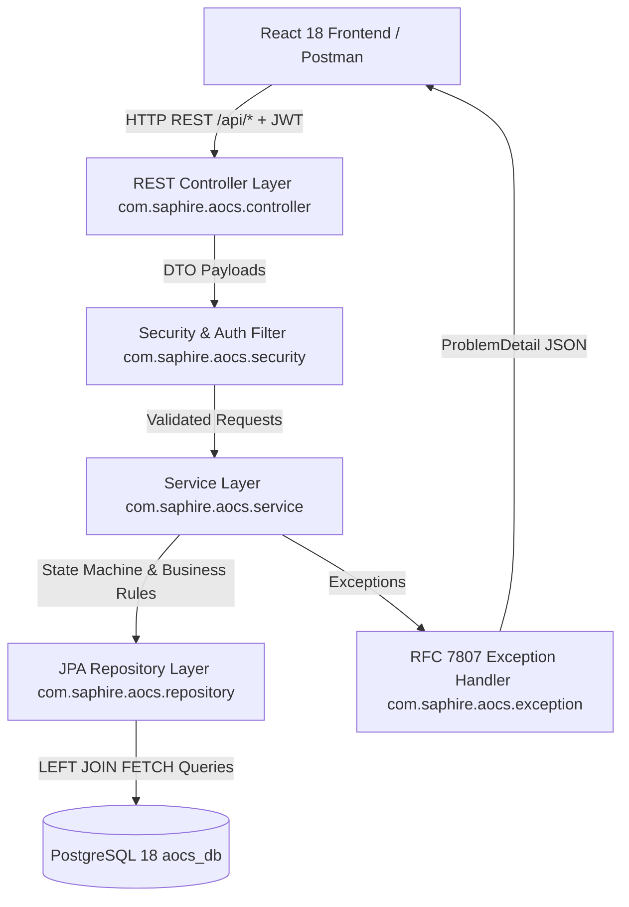

# Phase 2 Spring Boot Backend Architecture & Implementation Guide

**Project:** Saphire Airport Operations Coordination System (AOCS)  
**Branch:** `krishna`  
**Certification Status:** **Certified Grade A−** (Cleared for Phase 3 Frontend Integration)  

---

## 1. Executive Summary & System Overview

In Phase 2, we built the Spring Boot 3 REST API application layer on top of PostgreSQL 18 and the 17 JPA Entities created in Phase 1. 

The backend architecture follows strict **Layered Architecture Principles**:

---

## 2. Comprehensive Layer Breakdown

### 2.1 Security & Authentication Layer (`com.saphire.aocs.security`)
- **[SecurityConfig.java](file:///Users/krish/Desktop/Software%20Engineering/Mini%20Project/backend/src/main/java/com/saphire/aocs/security/SecurityConfig.java)**:
  - Disables CSRF (stateless API).
  - Configures `SessionCreationPolicy.STATELESS`.
  - Sets CORS policy strictly to `http://localhost:3000` (React frontend).
  - Configures `BCryptPasswordEncoder` bean.
  - Registers `JwtAuthFilter` in the Spring Security chain.
- **[JwtService.java](file:///Users/krish/Desktop/Software%20Engineering/Mini%20Project/backend/src/main/java/com/saphire/aocs/security/JwtService.java)**:
  - Generates signed HMAC-SHA256 JWT tokens containing `userId`, `username`, and `role`.
  - Enforces minimum 32-byte secret key length and fails closed if `aocs.jwt.secret` is missing.
  - Reads expiration time from `application.properties` (`aocs.jwt.expiration-ms=86400000` for 24h).
- **[JwtAuthFilter.java](file:///Users/krish/Desktop/Software%20Engineering/Mini%20Project/backend/src/main/java/com/saphire/aocs/security/JwtAuthFilter.java)**:
  - Intercepts incoming `Authorization: Bearer <token>` HTTP headers.
  - Validates the token signature and populates the `SecurityContext` with user credentials and granted authorities (`ROLE_ADMIN`, `ROLE_SUPERVISOR`, etc.).

---

### 2.2 Domain State Machines & Enums (`com.saphire.aocs.entity`)
- **[FlightStatus.java](file:///Users/krish/Desktop/Software%20Engineering/Mini%20Project/backend/src/main/java/com/saphire/aocs/entity/FlightStatus.java)**:
  - Enforces valid flight lifecycle state transitions:  
    `SCHEDULED` ➔ `LANDED` ➔ `ON_BLOCK` ➔ `SERVICING` ➔ `READY` ➔ `BOARDING` ➔ `AIRBORNE` ➔ `DEPARTED` (or `CANCELLED`/`DELAYED`).
  - Blocks illegal status jumps (e.g. `SCHEDULED` directly to `DEPARTED`) with `409 Conflict`.
- **[TaskStatus.java](file:///Users/krish/Desktop/Software%20Engineering/Mini%20Project/backend/src/main/java/com/saphire/aocs/entity/TaskStatus.java)**:
  - Enforces valid turnaround task transitions: `PENDING` ➔ `IN_PROGRESS` ➔ `COMPLETED` / `BLOCKED`.
  - Prevents fabricating fake timestamps when tasks update.

---

### 2.3 Business Service Layer (`com.saphire.aocs.service`)
- **[FlightService.java](file:///Users/krish/Desktop/Software%20Engineering/Mini%20Project/backend/src/main/java/com/saphire/aocs/service/FlightService.java)**:
  - `getSaphireHubFlights()`: Fetches all inbound/outbound flights for Saphire International Airport (`SPH`, `airport_id = 1`).
  - `updateFlightStatus(flightId, newStatus)`: Evaluates `FlightStatus` state transitions and updates actual timestamps (`actualArrivalTime`, `actualDepartureTime`, `boardingTime`) idempotently.
  - `createFlight(dto)`: Validates Saphire Hub constraint (`origin_airport_id = 1` OR `destination_airport_id = 1`) and resolves optional foreign keys.
- **[TurnaroundTaskService.java](file:///Users/krish/Desktop/Software%20Engineering/Mini%20Project/backend/src/main/java/com/saphire/aocs/service/TurnaroundTaskService.java)**:
  - `updateTaskStatus(taskId, status, userId, notes)`: Updates task progress, records `actualStart`/`actualEnd`, and logs ground crew `notes`.
  - **Automated Delay Logging**: If `actualEnd` > `scheduledEnd`, calculates turnaround delay minutes and generates a `DelayLog` record. Uses `@Lock(LockModeType.PESSIMISTIC_WRITE)` on the parent flight to prevent race conditions during sequence number calculation.
- **[GateService.java](file:///Users/krish/Desktop/Software%20Engineering/Mini%20Project/backend/src/main/java/com/saphire/aocs/service/GateService.java)**:
  - `getAllGates()`: Retrieves all gates, assigned stands, and active non-terminal flights.
  - `assignGateToFlight(dto)`: Performs **Ground Occupancy Window Overlap Checking** (`[start, end]`) for both Gates and Stands. Throws `409 Conflict` if a gate or stand is double-booked.
- **[AuthService.java](file:///Users/krish/Desktop/Software%20Engineering/Mini%20Project/backend/src/main/java/com/saphire/aocs/service/AuthService.java)**:
  - `login(dto)`: Verifies username and validates credentials using `passwordEncoder.matches(rawPassword, user.getPasswordHash())`. Returns user profile and a signed JWT token.
- **[ReportService.java](file:///Users/krish/Desktop/Software%20Engineering/Mini%20Project/backend/src/main/java/com/saphire/aocs/service/ReportService.java)**:
  - `getSummaryReport()`: Computes operational overview statistics (total flights, landed count, delayed count, on-time rate, task progress). Uses batch delay log set membership checks to eliminate N+1 queries.

---

### 2.4 REST Controller Layer (`com.saphire.aocs.controller`)
- **[FlightController.java](file:///Users/krish/Desktop/Software%20Engineering/Mini%20Project/backend/src/main/java/com/saphire/aocs/controller/FlightController.java)** (`/api/flights`): GET all hub flights, GET by ID, POST create flight, PUT update status.
- **[TaskController.java](file:///Users/krish/Desktop/Software%20Engineering/Mini%20Project/backend/src/main/java/com/saphire/aocs/controller/TaskController.java)** (`/api/tasks`): GET tasks by flight ID, POST create task, PUT update status, PUT assign user.
- **[GateController.java](file:///Users/krish/Desktop/Software%20Engineering/Mini%20Project/backend/src/main/java/com/saphire/aocs/controller/GateController.java)** (`/api/gates`): GET all gates/stands/active flights, PUT assign gate & stand.
- **[AuthController.java](file:///Users/krish/Desktop/Software%20Engineering/Mini%20Project/backend/src/main/java/com/saphire/aocs/controller/AuthController.java)** (`/api/auth`): POST login authentication endpoint.
- **[ReportController.java](file:///Users/krish/Desktop/Software%20Engineering/Mini%20Project/backend/src/main/java/com/saphire/aocs/controller/ReportController.java)** (`/api/reports`): GET operational summary statistics.

---

### 2.5 RFC 7807 Exception Handling (`com.saphire.aocs.exception`)
- **[GlobalExceptionHandler.java](file:///Users/krish/Desktop/Software%20Engineering/Mini%20Project/backend/src/main/java/com/saphire/aocs/exception/GlobalExceptionHandler.java)**:
  - Emits standard RFC 7807 `ProblemDetail` JSON responses with correlation IDs.
  - Maps `@Valid` payload validation failures (`MethodArgumentNotValidException`) to HTTP 400 Bad Request with a detailed `fieldErrors` map.
  - Maps malformed JSON (`HttpMessageNotReadableException`) to HTTP 400 Bad Request.
  - Maps method security denials (`AccessDeniedException`) to HTTP 403 Forbidden.
  - Maps domain conflict errors (`ConflictException`) to HTTP 409 Conflict.
  - Maps database constraint failures (`DataIntegrityViolationException`) to HTTP 409 Conflict without leaking raw SQL details.

---

### 2.6 Database Performance & Flyway Migration
- **[FlightRepository.java](file:///Users/krish/Desktop/Software%20Engineering/Mini%20Project/backend/src/main/java/com/saphire/aocs/repository/FlightRepository.java)**:
  - `findAllSaphireHubFlightsWithAllDetails()` uses `LEFT JOIN FETCH` across all 7 flight associations (`originAirport`, `destinationAirport`, `airline`, `aircraft`, `gate`, `stand`, `department`), completely eliminating N+1 queries.
- **[V3__add_password_and_notes.sql](file:///Users/krish/Desktop/Software%20Engineering/Mini%20Project/db/migration/V3__add_password_and_notes.sql)**:
  - Adds `password_hash` column to `users` table and populates existing seed accounts with valid BCrypt hashes (`$2a$10$...`).
  - Adds `notes` column to `tasks` table for ground crew logging.

---

## 3. Verification & Test Suite Summary

The unit and integration test suite (`src/test/java/com/saphire/aocs/`) contains 9 test classes covering both positive and negative paths:

1. **`FlightServiceTest.java`**: Tests state machine transition guards, SPH hub constraint enforcement, and idempotent timestamp behavior.
2. **`GateServiceTest.java`**: Tests ground occupancy window overlap checks on gates and stands (`409 Conflict`).
3. **`TurnaroundTaskServiceTest.java`**: Tests turnaround task progress, pessimistic locking on delay log sequence numbers, and notes persistence.
4. **`AuthServiceTest.java`**: Tests BCrypt password verification, uniform error response on bad credentials, and JWT token issuance.
5. **`FlightControllerValidationTest.java`**: Tests `@Valid` request body validation and verifies HTTP 400 `ProblemDetail` output.
6. **Controller MockMvc Tests**: `FlightControllerTest`, `TaskControllerTest`, `GateControllerTest`, `AuthControllerTest`.

---

## 4. Summary of Audit Artifacts Included

The complete audit history from Claude is preserved in this directory for reference:
- [Claude_Audit_Round1_Code_Review.md](file:///Users/krish/Desktop/Software%20Engineering/Mini%20Project/documentation/backend/Claude_Audit_Round1_Code_Review.md) (Initial Review - Grade C+)
- [Claude_Audit_Round2_Remediation_Audit.md](file:///Users/krish/Desktop/Software%20Engineering/Mini%20Project/documentation/backend/Claude_Audit_Round2_Remediation_Audit.md) (Second Audit - Grade B−)
- [Claude_Audit_Round3_Final_Certification_Audit.md](file:///Users/krish/Desktop/Software%20Engineering/Mini%20Project/documentation/backend/Claude_Audit_Round3_Final_Certification_Audit.md) (Third Audit - Grade B+)
- [Claude_Audit_Round3_Certification_Summary.md](file:///Users/krish/Desktop/Software%20Engineering/Mini%20Project/documentation/backend/Claude_Audit_Round3_Certification_Summary.md) (Final Certification - **Grade A−**)
