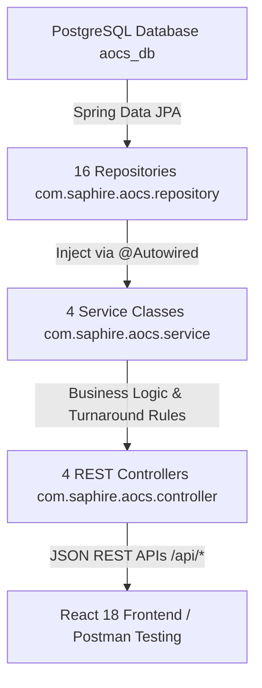

# Execution & Development Plan for Krishna's Branch (`krishna`)

**Project:** Saphire Airport Operations Coordination System (AOCS)  
**Branch Name:** `krishna`  
**Home Airport Hub:** Saphire International Airport (IATA: **`SPH`**, ICAO: **`VASP`**, `airport_id = 1`)  
**Target Completion Date:** Before 05 October 2026  
**Document Version:** 1.0  
**Date:** 2026-07-29  

---

## 1. Executive Context & Current Foundation (Phase 1 Completed)

On the `krishna` branch, we have established a complete, production-grade backend data foundation. This document acts as the master technical blueprint and context reference for all subsequent development sessions.

### 🌟 Completed Assets & Baseline Infrastructure:
* **Branch Isolation**: Dedicated git branch `krishna` (tracked at `origin/krishna`), completely independent from `main`.
* **Database Engine**: PostgreSQL 18 with **38 normalized tables** (`db/migration/V1__initial_schema.sql`) and **7,000+ seed records** (`db/migration/V2__seed_data.sql`).
* **Automated Migrations**: Flyway migration engine configured in `backend/src/main/resources/application.properties`.
* **Saphire Hub Constraint**: Strictly enforced at DB level (`CONSTRAINT chk_saphire_hub CHECK (origin_airport_id = 1 OR destination_airport_id = 1)`) and repository level (`findAllSaphireHubFlights()`).
* **Java ORM Data Layer**: **17 JPA `@Entity` classes** (`com.saphire.aocs.entity`) and **16 Spring Data Repositories** (`com.saphire.aocs.repository`).
* **NFR & Performance Guardrails**: `@ManyToOne(fetch = FetchType.LAZY)` fetch strategy, `JOIN FETCH` queries for sub-2-second latency, `@PrePersist` exception rollback for fuel variance ($\pm 1.0\%$), and `getMaskedPassportNumber()` confidentiality helper.

---

## 2. Phase 2 Plan: Java Spring Boot Backend Controllers & Services

In Phase 2, we build the REST API endpoints and turnaround business rules inside `backend/src/main/java/com/saphire/aocs/`.



### 2.1 Package Architecture
* `com.saphire.aocs.dto` — Data Transfer Objects for API request/response payloads.
* `com.saphire.aocs.service` — Turnaround workflow business logic, state transitions, validation.
* `com.saphire.aocs.controller` — REST Controller HTTP endpoints annotated with `@RestController` and `@CrossOrigin`.

### 2.2 Service Layer (`com.saphire.aocs.service`)

#### 1. `FlightService.java`
* `getSaphireHubFlights()`: Fetches all inbound/outbound flights for Saphire Airport (`SPH`).
* `updateFlightStatus(Long flightId, String newStatus)`: Manages state transitions (`SCHEDULED` $\rightarrow$ `LANDED` $\rightarrow$ `ON_BLOCK` $\rightarrow$ `SERVICING` $\rightarrow$ `READY` $\rightarrow$ `BOARDING` $\rightarrow$ `AIRBORNE` $\rightarrow$ `DEPARTED`).
* `createFlight(FlightDTO dto)`: Validates origin/destination and creates a new flight schedule.

#### 2. `TurnaroundTaskService.java`
* `getTasksByFlight(Long flightId)`: Fetches all turnaround tasks for a flight.
* `updateTaskStatus(Long taskId, String newStatus, Long userId, String notes)`: Updates task status (`PENDING` $\rightarrow$ `IN_PROGRESS` $\rightarrow$ `COMPLETED`). Automatically logs a `DelayLog` if `actualEnd > plannedEnd`.
* `assignTaskUser(Long taskId, Long userId)`: Assigns specific staff member to a task.

#### 3. `GateService.java`
* `getAllGates()`: Fetches all gates and assigned stands.
* `assignGateToFlight(Long flightId, Long gateId)`: Assigns gate to flight, checking for double-booking conflicts.

#### 4. `AuthService.java`
* `login(LoginDTO dto)`: Verifies username/password credentials, returns user profile, role, and department.

### 2.3 Controller Layer (`com.saphire.aocs.controller`)

| Controller | Base Path | Method | Endpoint | Purpose |
| :--- | :--- | :--- | :--- | :--- |
| **`FlightController`** | `/api/flights` | `GET` | `/` | Fetch all SPH hub flights. |
| | | `GET` | `/{id}` | Fetch single flight details. |
| | | `POST` | `/` | Create new flight schedule. |
| | | `PUT` | `/{id}/status` | Update flight status. |
| **`TaskController`** | `/api/tasks` | `GET` | `/flight/{flightId}` | Fetch all turnaround tasks for flight. |
| | | `PUT` | `/{taskId}/status` | Update task progress. |
| | | `POST` | `/` | Create custom task. |
| **`GateController`** | `/api/gates` | `GET` | `/` | Fetch all gates & stands. |
| | | `PUT` | `/assign` | Assign gate to flight. |
| **`AuthController`** | `/api/auth` | `POST` | `/login` | Authenticate user credentials. |
| **`ReportController`** | `/api/reports` | `GET` | `/summary` | Get operational summary statistics. |

---

## 3. Phase 3 Plan: React 18 + Material UI Frontend (`frontend/`)

In Phase 3, we initialize the React 18 (TypeScript) + Vite project in `frontend/` and build 15+ interactive web screens connected to your Spring Boot REST APIs.

### 3.1 Design System & Theme
* **Primary Palette**: Deep Navy (`#0f172a`), Primary Blue (`#1e40af`), Accent Teal (`#0d9488`), Background Soft Slate (`#f8fafc`).
* **Component Styling**: Glassmorphism cards, status chips (Green `READY`, Yellow `IN_PROGRESS`, Red `DELAYED`), progress bars, responsive drawer sidebar.

### 3.2 15+ Web Screens List

1. **`LoginPage.tsx`**: Staff login screen with role selection and credential verification.
2. **`DashboardPage.tsx`**: Real-time operations overview grid (Flights Today, Active Delays, Gate Map, Department Cards).
3. **`FlightSchedulePage.tsx`**: Flight list table with search, filter (Inbound/Outbound), and sorting.
4. **`FlightDetailPage.tsx`**: Individual flight view with turnaround progress bar and task status breakdown.
5. **`GateAllocationPage.tsx`**: Interactive gate and parking stand allocation map.
6. **`TaskTrackerPage.tsx`**: Turnaround task checklist grid filtered by department.
7. **`CabinCleaningModule.tsx`**: Cabin cleaning task checklist & inspection sign-off.
8. **`RefuelingModule.tsx`**: Fuel load input form with automatic $\pm 1\%$ target variance check and PIN safety approval.
9. **`MaintenanceModule.tsx`**: Line maintenance check form, avionics inspection log, technical issue alerts.
10. **`CateringModule.tsx`**: Galley cart replenishment tracker.
11. **`BoardingGateModule.tsx`**: Passenger boarding milestone controls & manifest passenger counter.
12. **`SecurityClearancePage.tsx`**: Ramp & cabin security sweep sign-off.
13. **`PassengerManifestPage.tsx`**: Passenger list with automated passport masking (`XXXX-XXXX-1234`).
14. **`ReportsAnalyticsPage.tsx`**: Turnaround delay cause breakdown charts and PDF/Excel export controls.
15. **`AuditLogViewer.tsx`**: Security action log viewer showing user actions, IP addresses, and timestamps.

---

## 4. Phase 4 Plan: Academic Deliverables & SRS Backup

To provide a complete backup for the team's academic evaluation submission:

1. **Software Requirement Specification (SRS)**: Complete SRS document created in `documentation/DOCS/SRS_Document.md`.
2. **UML Diagram Suite**:
   * **Use Case Diagram**: Admin, Supervisor, and Department Staff actors.
   * **Class Diagram**: Matching the 17 Java Entities.
   * **Sequence Diagrams**: Turnaround workflow sequence (*Landing ➔ Gate Allocation ➔ Task Execution ➔ Departure*).
3. **Postman API Collection**: JSON collection file for testing all REST endpoints.

---

## 5. Development Roadmap Summary

```text
[Phase 1: DB & Data Layer] ➔ COMPLETED (17 Entities, 16 Repositories, Flyway V1 & V2)
         │
         ▼
[Phase 2: Backend APIs]   ➔ Build 4 REST Controllers & 4 Services (Spring Boot)
         │
         ▼
[Phase 3: React Frontend] ➔ Build 15+ Material UI Screens in frontend/ (React 18 + TS)
         │
         ▼
[Phase 4: Verification]   ➔ Connect React UI to Spring Boot APIs + Postman Testing
```

---

## 6. How to Resume Work in a New Chat Session

When starting a new chat under this project, provide this instruction:

> *"We are working on the `krishna` branch following `plan_Krishna.MD`. Phase 1 (Database & ORM Data Layer) is 100% complete. Let's proceed with Phase 2: building the Spring Boot Services and REST Controllers (`FlightController`, `TaskController`, `GateController`, `AuthController`)."*
